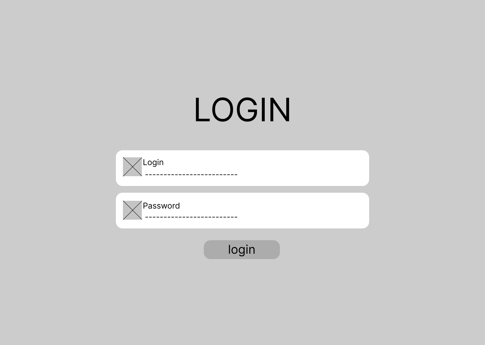
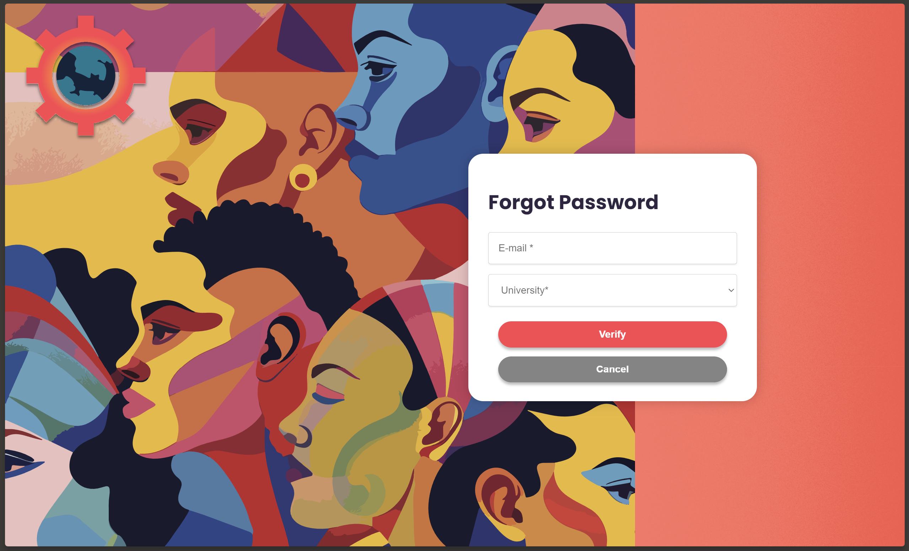

# WAD - Web Application Document - Módulo 2 - Inteli


## WebCulture Group

#### Ana Beatriz Passos Beggiato
#### André Dleizer Prado
#### Cecília Lima Coelho
#### Laura de Araújo Rodrigues
#### Mariana Namie Guima
#### Marlos do Carmo Guedes
#### Thalyta da Silva Viana

<br>

## Sumário

[1. Introdução](#c1)

[2. Visão Geral da Aplicação Web](#c2)<br>
[2.1. Escopo do Projeto](#c2.1)<br>
[2.1.1. Contexto da Indústria](#c2.1.1)<br>
[2.1.2. Modelo de 5 Forças de Porter](#c2.1.2)<br>
[2.1.3. Análise SWOT](#c2.1.3)<br>
[2.1.4. Solução](#c2.1.4)<br>
[2.1.5. Proposta de Valor](#c2.1.5)<br>
[2.1.6. Matriz de Riscos](#c2.1.6)<br>
[2.2. Personas](#c2.2)<br>
[2.3. User Stories](#c2.3)<br>

[3. Projeto Técnico da Aplicação Web](#c3)<br>
[3.1. Arquitetura](#c3.1)<br>
[3.1.1. Arquitetura MVC com Banco de Dados PostgreSQL](#c3.1.1)<br>
[3.1.2. Modelos (Models)](#c3.1.2)<br>
[3.1.3. Visões (Views)](#c3.1.3)<br>
[3.1.4. Controladores (Controllers)](#c3.1.4)<br>
[3.1.5. Banco de Dados (BD)](#c3.1.5)<br>
[3.2. Wireframes](#c3.2)<br>
[3.2.1. Wireflow](#c3.2.1)<br>
[3.3. Guia de estilos](#c3.3)<br>
[3.3.1. Cores](#c3.3.1)<br>
[3.3.2. Tipografia](#c3.3.2)<br>
[3.3.3. Iconografia e imagens](#c3.3.3)<br>
[3.3.4. Implementação do GRID no protótipo](#c3.3.4)<br>
[3.4. Protótipo de alta fidelidade](#c3.4)<br>
[3.4.1. Tela de homepage](#c3.4.1)<br>
[3.4.2. Tela de avaliações](#c3.4.2)<br>
[3.4.2.1 Tela de autoavaliação](#c3.4.2.1)<br>
[3.4.2.Tela de avaliação de pares](#c3.4.2.2)<br>
[3.4.3. Tela do grupo](#c3.4.3)<br>
[3.4.4. Tela de perfil](#c3.4.4)<br>
[3.5. Modelagem do banco de dados](#c3.5)<br>
[3.5.1. Modelo relacional](#c3.5.1)<br>
[3.5.2. Consultas SQL e lógica proposicional](#c3.5.2)<br>
[3.6. WebAPI e endpoints](#c3.6)<br>

[4. Desenvolvimento da Aplicação Web](#c4)<br>
[4.1. Primeira versão da aplicação web](#c4.1)<br>
[4.1.1. Tela de cadastro](#c4.1.1)<br>
[4.1.2. Tela de login](#c4.1.2)<br>
[4.1.3. Home](#c4.1.3)<br>
[4.1.4. tooltip Personalizada](#c4.1.4)<br>
[4.1.5. Dficuldades](#c4.1.5)<br>
[4.1.6. Próximos passos](#c4.1.6)<br>
[4.2. Segunda versão da aplicação web](#c4.2)<br>
[4.2.1. Tela de avaliação do estilo de colaboração](#c4.2.1)<br>
[4.2.1.1. Telas de resultado do estilo de colaboração](#c4.2.1.1)<br>
[4.2.2. Tela de Perfil](#c4.4.2)<br>
[4.2.3. Tela de homepage](#c4.2.3)<br>
[4.2.4. Tela de formulário de Decision-Making](#c4.2.4)<br>
[4.2.5. Telas de resultado de Decision-Making](#c4.2.5)<br>
[4.2.6. Dificuldades](#c4.2.6)<br>
[4.2.7. Próximos passos](#c4.2.7)<br>
[4.3. Versão final da aplicação web](#c4.3)<br>
[4.3.1. Tela de perfil](#c4.3.1)<br>
[4.3.2. Homepage](#c4.3.2)<br>
[4.3.3. Tela de avaliação de pares](#c4.3.3)<br>
[4.3.4. Tela de grupos](#c4.3.4)<br>
[4.3.5. Tela de esqueceu a senha](#c4.3.5)<br>
[4.3.6. Tela de Admin](#c4.3.6)<br>
[4.6.7. Barra de progresso](#c4.6.7)<br>

[5. Testes da Aplicação Web](#c5)<br>
[5.1. Relatório de testes automatizados](#c5.1)<br>
[5.1.1. Arquivo index.html](#5.1.1)<br>
[5.1.2. Teste do helper hashPassword](#c5.1.2)<br>
[5.1.3. Teste do controller HomepageController](#c5.1.3)<br>
[5.1.4. Teste do controller ColabController](#c5.1.4)<br>
[5.1.5. Teste do controller AuthController](#c5.1.5)<br>
[5.1.6. Teste do controller UsuarioController](#c5.1.6)<br>
[5.1.7. Teste do controller ProfileController](#c5.1.7)<br>
[5.1.8. Teste do helper Format-email](#c5.1.8)<br>
[5.1.9. Teste do helper Upload](#c5.1.9)<br>
[5.1.10. Conclusão](#c5.1.10)<br>
[5.2. Testes de usabilidade](#c5.2)<br>
[5.2.1. Registros de testes e melhorias](#c5.2.1)<br>
[5.2.2 Registro do Teste de System Usability Scale(SUS)](#c5.2.2)<br>

[6. Conclusões e trabalhos futuros](#c6)

[7. Referências](#c7)

[Anexos](#c8)

## Lista de figuras

[Figura 01 - 5 forças de Porter](#f1)

[Figura 02 - Análise SWOT](#f2)

[Figura 03 - Value Proposition Canvas](#f3)

[Figura 04 - Matros de Riscos](#f4)

[Figura 05 - Persona do aluno 1](#f5)

[Figura 06 - Mapa de empatia do aluno 1](#f6)

[Figura 07 - Persona do aluno 2](#f7)

[Figura 08 - Mapa de empatia do aluno 2](#f8)

[Figura 09 - Diagrama de Arquitetura](#f9)

[Figura 10 - Wireframe do login](#f10)

[Figura 11 - Wireframe do cadastro](#f11)

[Figura 12 - Wireframe da tela inicial](#f12)

[Figura 13 - Wireframe do perfil](#f13)

[Figura 14 - Wireframe da autoavaliação](#f14)

[Figura 15 - Wireframe da avaliação de pares](#f15)

[Figura 16 - Wireframe dos feedbacks](#f16)

[Figura 17 - Wireflow](#f17)

[Figura 18 - Guia de estilos](#f18)

[Figura 19 - 4 opções de paletas de cores](#f19)

[Figura 20 - Paleta de cores definitiva](#f20)

[Figura 21 - Paleta de cores com hex](#f21)

[Figura 22 - Tipografia](#f22)

[Figura 23 - Ícones](#f23)

[Figura 24 - Imagem do Logotipo](#f24)

[Figura 25 - Imagem de fundo da tela de login](#f25)

[Figura 26 - Imagem da homepage](#f26)

[Figura 27 - Imagem da tela de tickets](#f27)

[Figura 28 - GRID da tela de feedbacks](#f28)

[Figura 29 - Diagrama dos prototipos](#f29)

[Figura 30 - Modelagem relacional do banco de dados](#f30)

[Figura 31 - Tela de cadastro](#f31)

[Figura 32 - Tela de login](#f32)

[Figura 33 - Parte de cima da tela de Homepage](#f33)

[Figura 34 -  Parte de baixo da tela de homepage](#f34)

[Figura 35 - Tooltip da sidebar](#f35)

[Figura 36 - Layout da tela de resultado](#f36)

[Figura 37 - Tela de perfilr](#f37)

[Figura 38 - Parte inferior da homepage](#f38)

[Figura 39 - Pop-up de criação da task](#f39)

[Figura 40 - Quadro de tasks após a inderção de uma nova task](#f40)

[Figura 41 - Layout do Decision-Making Style](#f41)

[Figura 42 - Layout do Given Situations](#f42)

[Figura 43 - Layout dos resultados de Decision Making](#f43)

[Figura 44 - Tela final de perfil](#f44)

[Figura 45 - Tela final da homepage](#f45)

[Figura 46 - Tela final das tasks](#f46)

[Figura 47 -  Dropdown dos membros a serem avaliados](#f47)

[Figura 48 -  Avaliação de pares para o estilo de colaboração](#f48)

[Figura 49 - Figma da tela de grupo](#f49)

[Figura 50 - Avaliação de pares para a tomada de decisão](#f50)

[Figura 51 - Front-end da tela de grupo](#f51)

[Figura 52 - Front-end da tela de esqueceu a senha](#f52)

[Figura 53 - Front-end da tela de esqueceu a senha](#f53)

[Figura 54 - Front-end da tela de admin](#f54)

[Figura 55 - Barra de Progresso](#f55)

[Figura 56 -  Avaliação de pares (decision-making)](#f56)

[Figura 57 - Avaliação de pares (collaboration)](#f57)

[Figura 58 - Tela de perfil dos membros](#f58)

[Figura 59 - Documentação das tarefas de teste 1 e 2](#f59)

[Figura 60 - Documentação das tarefas de teste 3 e 4](#f60)

[Figura 61 - Documentação das tarefas de teste 5 e 6](#f61)

[Figura 62 - Gráfico de sucesso da tarefa 1](#f62)

[Figura 63 - Gráfico de sucesso da tarefa 2](#f63)

[Figura 64 - Gráfico de sucesso da tarefa 3](#f64)

[Figura 65 - Gráfico de sucesso da tarefa 4](#f65)

[Figura 66 - Gráfico de sucesso da tarefa 5](#f66)

[Figura 67 - Gráfico de sucesso da tarefa 6](#f67)

[Figura 68 - Tabela de severidade das ocorrências](#f68)

[Figura 69 - Exemplo de questionário do Teste SUS](#f69)

[Figura 70 - System Usability Score](#f70)

[Figura 71 - Resultado do teste SUS 01](#f71)

[Figura 72 - Resultado do teste SUS 02](#f72)

[Figura 73 - Resultado do teste SUS 03](#f73)

[Figura 74 - Resultado do teste SUS 04](#f74)

[Figura 75 - Resultado do teste SUS 05](#f75)

[Figura 76 - Resultado do teste SUS 06](#f76)

[Figura 77 - Resultado do teste SUS 07](#f77)


## Lista de tabelas

[Tabela 01 - User story 01](#t1) 

[Tabela 02 - User story 02](#t2) 

[Tabela 03 - User story 03](#t3) 

[Tabela 04 - User story 04](#t4)

[Tabela 05 - User story 05](#t5)

[Tabela 06 - User story 06](#t6) 

[Tabela 07 - User story 07](#t7) 

[Tabela 08 - User story 08](#t8) 

[Tabela 09 - User story 09](#t9) 

[Tabela 10 - User story 09](#t10) 

[Tabela 11 - User story 09](#t11) 

[Tabela 12 - User story 09](#t12) 

[Tabela 13 - User story 09](#t13) 

[Tabela 14 - Tamanho de texto](#t14) 

[Tabela 15 - Primeira consulta SQL](#t15) 

[Tabela 16 - Segunda consulta SQL](#t16) 

[Tabela 17 - Terceira consulta SQL](#t17) 

[Tabela 18 - Correlação de itens e perfis](#t18) 

<br>


# <a name="c1"></a>1. Introdução

&nbsp;&nbsp;&nbsp;&nbsp;A ZUYD é uma instituição de ensino superior localizada em Maastricht<sup>1</sup>, na Europa, especializada em Ciências Aplicadas. Suas aulas são conhecidas por serem altamente interativas e centradas em projetos, ministradas em grupos com até 15 alunos. Essa abordagem pedagógica favorece um desenvolvimento profissional qualificado e criativo, proporcionando espaço para orientação individualizada.³
<br>
&nbsp;&nbsp;&nbsp;&nbsp;No entanto, o parceiro destacou a problemática acerca da comunicação dentro do jogo "*Cesim Game*", sendo que esta comunicação entre os grupos é notavelmente ineficiente, devido à ausência de uma plataforma adequada para essas interações. Além disso, a diversidade cultural dos participantes contribui para a existência de diversos preconceitos, agravando ainda mais o problema.
<br>
&nbsp;&nbsp;&nbsp;&nbsp;Assim, à medida que a tecnologia avança, torna-se necessário promover a integração desses estudantes nos contextos em que estão inseridos. Surge, portanto, a necessidade de elaborar um sistema web que promova a colaboração e a comunicação eficaz entre os participantes do "*Cesim Game*". Este projeto propõe a criação de uma plataforma dedicada à integração dos estudantes envolvidos nessa simulação de negócios, com o propósito de facilitar uma cooperação mais sólida e uma comunicação transparente entre os membros do grupo.
<br>
&nbsp;&nbsp;&nbsp;&nbsp;No mais, a plataforma oferece espaços onde os usuários podem avaliar seus colegas de equipe, bem como visualizar as avaliações recebidas, contribuindo, assim, para um ambiente de aprendizado colaborativo e construtivo. Este sistema não apenas visa aprimorar a experiência dos estudantes envolvidos, mas também maximizar os benefícios educacionais proporcionados pelas simulações de negócios, preparando-os para os desafios do mundo empresarial por meio do desenvolvimento de habilidades de trabalho em equipe e comunicação efetiva.

# <a name="c2"></a>2. Visão Geral da Aplicação Web
&nbsp;&nbsp;&nbsp;&nbsp;Nesta seção, voltada para a visão geral da aplicação web em desenvolvimento, serão abordados tópicos importantes para o desenvolvimento do projeto, tais como seu escopo - o qual apresenta uma análise de contexto do parceiro -, as personas ideais para a utilização do site e as user stories criadas em torno do projeto a fim de traçar sua rota de desenvolvimento. Assim, a visão geral da aplicação web traz os tópicos fundamentais para a compreensão do parceiro de projeto, assim como demonstra uma base para traçar o caminho de desenvolvimento da solução proposta.

## <a name="c2.1"></a> 2.1. Escopo do Projeto

&nbsp;&nbsp;&nbsp;&nbsp;Nesta seção, será realizada uma análise do mercado no qual a empresa parceira de projeto se insere, a fim de que possamos entender suas forças e fraquezas, assim como identificar as oportunidades disponíveis no cenário. Para tal, serão utilizadas ferramentas como as 5 forças de Porter, voltadas para a análise da concorrência de mercado, a matriz SWOT, que contribui para entender as forças, fraquezas, oportunidades e ameaças da empresa, o Canvas de Proposta de Valor, cuja importância está na descrição dos atributos de valor da solução oferecida e, por fim, a matriz de riscos, empregada para monitorar os riscos do projeto. Essas ferramentas, combinadas, oferecem uma visão geral do mercado e da posição da empresa dentro dele, permitindo uma tomada de decisão mais eficaz para o sucesso da empresa e dos projetos ligados.

### <a name="c2.1.1"></a>2.1.1. Contexto da Indústria

&nbsp;&nbsp;&nbsp;&nbsp;A Universidade Zuyd de Ciências Aplicadas, na Europa, é conhecida pela qualidade na educação, pesquisa e formação profissional. Com 14.600 alunos, dos quais 11% são internacionais, a Zuyd se destaca por sua diversidade e colaboração com empresas e instituições. No ranking "QS Top Universities", ocupa a posição #141 no oeste da Europa e entre #541-550 na Europa. O modelo de negócios da Zuyd é baseado na oferta de programas de alta qualidade, focados em projetos práticos e parcerias estratégicas. Seus principais concorrentes incluem outras universidades de ciências aplicadas na Europa, e as tendências apontam para a crescente importância da educação online.
<br>
&nbsp;&nbsp;&nbsp;&nbsp;Para entender a dinâmica competitiva em que a Zuyd está inserida, são utilizadas várias ferramentas de análise de mercado. As 5 Forças de Porter ajudam a entender a competitividade no setor educacional, enquanto a análise SWOT permite identificar as forças, fraquezas, oportunidades e ameaças específicas da Zuyd. O Canvas de Proposta de Valor é empregado para descrever os atributos únicos da solução educacional oferecida pela instituição, e a Matriz de Riscos é utilizada para monitorar e gerenciar os riscos associados ao projeto educacional.
<br>
&nbsp;&nbsp;&nbsp;&nbsp;Essas ferramentas combinadas oferecem uma visão holística do mercado educacional e da posição da Zuyd dentro dele, permitindo que os gestores da instituição tomem decisões mais informadas e eficazes. Essa análise detalhada contribui para a formulação de estratégias que possam fortalecer ainda mais a posição da Zuyd no mercado educacional europeu, garantindo a sua contínua evolução


### <a name="c2.1.2"></a> 2.1.2. Modelo de 5 Forças de Porter

&nbsp;&nbsp;&nbsp;&nbsp;Nesta seção da documentação, foi aplicado o "Modelo de 5 Forças de Porter" para avaliar as dinâmicas competitivas enfrentadas pela Zuyd *University* no setor de ensino superior. Desenvolvido por Michael E. Porter, este modelo é fundamental para identificar e analisar cinco forças competitivas que definem cada indústria e mercado, influenciando diretamente nossa capacidade de atender os estudantes e gerar valor sustentável.
<br>
&nbsp;&nbsp;&nbsp;&nbsp;A seguir, detalhamos cada uma dessas forças no contexto universitário, oferecendo insights sobre a rivalidade entre concorrentes, a ameaça de novos entrantes, o poder de barganha de fornecedores e clientes, e a ameaça de produtos ou serviços substitutos. Esta análise nos permite não só entender o ambiente competitivo em que a Zuyd se insere, mas também identificar oportunidades de reforço da posição da empresa no mercado educacional.

<div align="center">
  <sub><a name="f1"></a>Figura 01 - 5 Forças de Porter</sub>
  
  <sup>Fonte: Elaborado pelos autores (2024)</sup>
</div>

&nbsp;&nbsp;&nbsp;&nbsp;**1. Rivalidade entre Concorrentes:** Esta força destaca a competição entre a Zuyd *University* e outras instituições de ensino superior. A universidade enfrenta concorrentes tanto holandeses quanto internacionais, o que a obriga a manter a excelência e a inovação nos programas oferecidos, especialmente aqueles em inglês, que atraem estudantes globais. A rivalidade impulsiona a universidade a diferenciar-se por meio de uma oferta educacional de qualidade, visando destacar-se no mercado.
<br>
&nbsp;&nbsp;&nbsp;&nbsp;**2. Ameaça de Novos Entrantes:** As barreiras de entrada incluem a reputação institucional e a infraestrutura necessária para o funcionamento de uma universidade. Embora essas barreiras possam ser significativas, a crescente popularidade da educação online tem o potencial de diminuir tais obstáculos, tornando mais fácil a entrada de novos players no mercado e ameaçando a posição de instituições estabelecidas como a Zuyd.
<br>
&nbsp;&nbsp;&nbsp;&nbsp;**3. Poder de Barganha dos Fornecedores:** Os fornecedores no contexto universitário são principalmente os acadêmicos e pesquisadores. Para a Zuyd, é importante oferecer condições atrativas para garantir a contratação e a retenção de professores e pesquisadores de reconhecida qualificação, contribuindo assim para a qualidade do ensino e da pesquisa na universidade. 
<br>
&nbsp;&nbsp;&nbsp;&nbsp;**4. Poder de Barganha dos Clientes (Estudantes):** Os estudantes, enquanto clientes, possuem um alto poder de barganha. Eles têm a liberdade de escolher entre várias instituições, buscando um equilíbrio entre a qualidade de ensino e o custo da educação. As expectativas dos estudantes por inovação e flexibilidade nos métodos de ensino incentivam as universidades a se adaptarem continuamente às suas necessidades e preferências.
<br>
&nbsp;&nbsp;&nbsp;&nbsp;**5. Ameaça de Produtos ou Serviços Substitutos:** O crescimento da educação à distância e dos cursos online representa uma ameaça significativa aos modelos educacionais tradicionais. A Zuyd *University* pode ter que inovar e se adaptar para manter sua relevância diante dessas opções de ensino mais flexíveis e, muitas vezes, mais acessíveis, as quais atendem a um público mais amplo e diversificado.
<br>

### <a name="c2.1.3"></a> 2.1.3. Análise SWOT

&nbsp;&nbsp;&nbsp;&nbsp;A análise SWOT é uma ferramenta utilizada no planejamento empresarial, com a finalidade de avaliar os fatores que impactam a empresa. Esta análise inclui causas externas e internas, sendo que as forças e fraquezas estão relacionadas ao ambiente interno, enquanto as oportunidades e ameaças dizem respeito ao ambiente externo.
<br>

<div align="center">
  <sub><a name="f2"></a>Figura 02 - Análise SWOT</sub>
  
  <sup>Fonte: Elaborado pelos autores (2024)</sup>
</div>

<br>
&nbsp;&nbsp;&nbsp;&nbsp;Diante dessa análise, nota-se que a ZUYD *university*, em Heerlen, é uma das maiores nos Países Baixos, com uma vasta oferta de graduações e pós-graduações.<sup>3</sup> Reconhecida por sua excelência e pesquisa relevante, enfrenta desafios como a competição e a visibilidade internacional limitada.<sup>4</sup> No entanto, vê oportunidades em financiamento e colaborações interdisciplinares.<sup>5</sup>
<br>
&nbsp;&nbsp;&nbsp;&nbsp;No entanto, ameaças como mudanças políticas e instabilidade econômica representam riscos para seu crescimento e desenvolvimento futuro. Sua reputação como uma das melhores faculdades em Heerlen solidifica sua posição como um centro de excelência educacional<sup>6</sup>, mas atrair estudantes e pesquisadores internacionais ainda é um desafio.

### <a name="c2.1.4"></a> 2.1.4. Solução 

&nbsp;&nbsp;&nbsp;&nbsp;A ZUYD *University of Applied Sciences* realiza um jogo de negócios em equipe denominado “*Cesim Game*”, no qual alunos de diferentes culturas precisam interagir a fim de solucionar os desafios apresentados no jogo. Entretanto, nessas interações, as diferenças interculturais costumam dificultar a comunicação entre os participantes, fato esse que pode levar a equipe a uma convivência desarmônica, prejudicando seu desempenho. Aqui, dados como a área de compras e a lista de fornecedores da empresa não se aplicam à análise em questão.
<br>
&nbsp;&nbsp;&nbsp;&nbsp;Visando a solução de tal problema, a *WebCulture Group* propõe uma aplicação web na qual os membros de cada grupo possam acessar o feedback dado por seus colegas, tendo acesso a informações importantes como uma comparação entre sua autoavaliação e sua avaliação de pares. Ainda, o usuário poderá ter uma visão geral dos seus colegas de time, assim como uma visão da média de felicidade do grupo com relação ao trabalho que está sendo desenvolvido.
<br>
&nbsp;&nbsp;&nbsp;&nbsp;Para que essa aplicação possa ser utilizada, o competidor precisará fazer seu login no site, tendo então acesso a uma *homepage* na qual serão disponibilizados acessos a páginas como “perfil”, “grupo”, "autoavaliação" e "avaliação de pares", as quais serão responsáveis por garantir a cada participante uma visão geral de si e de seus colegas, proporcionando assim uma convivência mais harmônica no grupo.
<br>
&nbsp;&nbsp;&nbsp;&nbsp;A solução proposta proporciona aos participantes uma melhor visão sobre o seu desempenho no grupo do ponto de vista dos seus colegas, permitindo assim melhorias pessoais e entendimento de seus perfis de atuação dentro do grupo. Com isso, são geradas motivações para comunicações mais diretas voltadas para a resolução dos conflitos dentro do time, permitindo, assim, uma convivência mais harmônica.
<br>
&nbsp;&nbsp;&nbsp;&nbsp;A fim de medir o sucesso da solução, serão avaliados os desempenhos comportamentais e comunicativos de cada grupo, ou seja, se a solução for efetiva, cada grupo terá uma comunicação mais efetiva em momentos de conflito, assim como os membros terão mais abertura para fornecer feedbacks aos colegas, evitando, com isso, ruídos de comunicação que prejudiquem a harmonia do grupo.


### <a name="c2.1.5"></a> 2.1.5. Proposta de Valor

&nbsp;&nbsp;&nbsp;&nbsp;O Canvas de Proposta de Valor é definido para visualizar, projetar e testar a criação de valor da empresa para o cliente. Para isso, o Canvas aborda não só as dores e ganhos de valor por parte do cliente, mas também os analgésicos e criadores de valor por parte da solução que está sendo desenvolvida. Assim, para a aplicação em questão, foi desenvolvido o seguinte Canvas de Proposta de Valor:

<div align="center">
<sub><a name="f3"></a>Figura 03 - Value Proposition Canvas</sub>

<sup>Fonte: Material produzido pelos autores (2024)</sup>
</div>

Proposta de Valor:
- Produtos/Serviços:
  - Uma aplicação web que proporcione integração entre os participantes por meio de feedbacks e avaliações.
- Analgésicos (Alívio de Dores):
  - Redução das dificuldades de comunicação intercultural.
  - Melhoria do desempenho das equipes no jogo de negócios.
  - Diminuição da convivência desarmônica.
- Criadores de Ganhos:
  - Melhor visão do desempenho individual e do grupo.
  - Estímulo à comunicação direta e resolução de conflitos.
  - Promoção de uma convivência mais harmoniosa.
  - Desenvolvimento de atividades interpessoais.

Cliente:
- Trabalhos:
  - Realização do jogo de negócios "Cesim Game".
  - Facilitação da interação entre alunos de diferentes culturas.
- Dores:
  - Dificuldades na comunicação devido às diferenças interculturais.
  - Convivência desarmônica prejudicando o desempenho das equipes.
  -  de uma plataforma para autoavaliação e avaliação de pares.
- Ganhos:
  - Melhoria do desempenho das equipes no jogo de negócios.
  - Comunicação mais efetiva entre os participantes.
  - Visão clara do próprio desempenho e do desempenho do grupo.

&nbsp;&nbsp;&nbsp;&nbsp;Em suma, o Canvas de Proposta de Valor oferece uma visão abrangente dos elementos necessários para a criação de valor da solução proposta, considerando as necessidades e expectativas do cliente. Ao abordar tanto as dores enfrentadas quanto os ganhos esperados, bem como os analgésicos e criadores de valor proporcionados pela solução, o Canvas se torna uma ferramenta importante para orientar o desenvolvimento de produtos e serviços centrados no cliente.


### <a name="c2.1.6"></a> 2.1.6. Matriz de Riscos 

&nbsp;&nbsp;&nbsp;&nbsp;A matriz de riscos é uma ferramenta estratégica indispensável, mapeando a probabilidade e o impacto de potenciais problemas, desde comunicações falhas até situações improváveis. Ela é indispensável para priorizar os esforços devidos, ajustando-se continuamente às mudanças do cenário do projeto, e assegura que estejamos preparados para enfrentar e gerenciar desafios de forma eficaz, mantendo o projeto alinhado com os objetivos estipulados.

<div align="center">
<sub><a name="f4"></a>Figura 04 - Matriz de Riscos</sub>

<sup>Fonte: Material produzido pelos autores (2024)</sup>
</div>

**Planos de Ação para os Riscos Identificados**

1. Erros de comunicação menores: melhorar a clareza e a frequência das comunicações internas através de reuniões regulares e uso de ferramentas de comunicação colaborativa.

2. Atraso na aquisição de recursos menores: implementar um processo de planejamento e monitoramento mais rigoroso para aquisições.

3. Escopo mal definido: realizar workshops de definição de escopo com todas as partes interessadas no início do projeto.

4. Falha no cumprimento de marcos críticos: estabelecer um cronograma detalhado com checkpoints e responsabilidades claras.

5. Dependência de tecnologias obsoletas: investir em atualização tecnológica e treinamento contínuo.

6. Conflitos na equipe não resolvidos: promover sessões de mediação e workshops de team building.

7. Erros na documentação do projeto: adotar uma revisão dupla e auditorias regulares da documentação.

8. Dificuldades de integração entre sistemas: realizar testes de integração contínuos e utilizar uma arquitetura modular.

9. Problemas significativos de qualidade: estabelecer um processo de garantia de qualidade rigoroso com testes regulares.

10. Catástrofes naturais impactando diretamente o projeto: desenvolver um plano de continuidade de negócios e estratégias de recuperação de desastres.

11. Problemas técnicos e de acessibilidade: implementar testes rigorosos de acessibilidade e desempenho contínuos, corrigindo rapidamente quaisquer problemas identificados.

&nbsp;&nbsp;&nbsp;&nbsp;A análise da matriz de riscos sublinha a necessidade de uma gestão de riscos ágil e informada, essencial para o desenvolvimento da nossa plataforma. Ela orienta a implementação de protocolos de amenização e recuperação, destacando a importância de planos de contingência que abordam tanto inconvenientes menores quanto eventos de alto impacto, assegurando a continuidade do projeto e a confiança dos stakeholders na gestão eficiente das incertezas quanto ao nosso trabalho. 

## <a name="c2.2"></a> 2.2. Personas

&nbsp;&nbsp;&nbsp;&nbsp;As personas são representações fictícias de possíveis usuários de um produto ou serviço, as quais demonstram os objetivos, necessidades e frustações do cliente para que o produto seja desenvolvido focado nas dores e metas do usuário, tornando-o mais conveniente e competitivo no mercado <sup>5</sup>. Enquanto isso, os mapas de empatia analisam e detalham mais profundamente os sentimentos, pensamentos, falas e ações do cliente, sendo útil para complementar as personas <sup>6</sup>.

&nbsp;&nbsp;&nbsp;&nbsp;No projeto com a Zuyd *university*, um site será criado para a avaliação entre os alunos do jogo *Cesim Global Challenge*. Dessa forma, foram mapeadas duas personas que representam diferentes perfis de estudante. Abaixo, seguem as personas com seus respectivos mapas de empatia.

<div align="center">
<sub><a name="f5"></a>Figura 05 - Persona do aluno 1</sub>

<sup>Fonte: Material produzido pelos autores (2024)</sup>
</div>

<div align="center">
<sub><a name="f6"></a>Figura 06 - Mapa de empatia do aluno 1</sub>

<sup>Fonte: Material produzido pelos autores (2024)</sup>
</div>

&nbsp;&nbsp;&nbsp;&nbsp;A partir dessa persona, pode-se mapear a preocupação com a tolerância e o preconceito cultural, a importância do respeito e a necessidade de feedbacks sobre o seu desempenho. Dessa forma, deve-se desenvolver um *website* que permita trocas culturais e disponibilize feedbacks somente com alternativas, para evitar que grosserias sejam escritas.


<div align="center">
<sub><a name="f7"></a>Figura 07 - Persona do aluno 2</sub>

<sup>Fonte: Material produzido pelos autores (2024)</sup>
</div>

<div align="center">
<sub><a name="f8"></a>>Figura 08 - Mapa de empatia do aluno 2</sub>

<sup>Fonte: Material produzido pelos autores (2024)</sup>
</div>

&nbsp;&nbsp;&nbsp;&nbsp; Percebe-se a preocupação dessa persona de se destacar por excelência acadêmica e realização de *networking*. Assim, para indivíduos com esse perfil, seria conveniente que nosso site tivesse uma área para postar conteúdos acadêmicos, uma vez que isso propiciaria a troca de conhecimentos entre os membros do grupo.


&nbsp;&nbsp;&nbsp;&nbsp; Dessa maneira, observa-se a importância das personas para mapear as necessidades e as dores dos usuários que podem ser solucionadas ou amenizadas pela nossa aplicação web. Por fim, elas também auxiliarão na elaboração das user stories, as quais serão apresentadas e explicadas no tópico 2.3.

## <a name="c2.3"></a> 2.3. User Stories 

&nbsp;&nbsp;&nbsp;&nbsp;*User stories* são frases que simulam a perspectiva do cliente, destacando quem ele é, as suas necessidades e os benefícios da realização das suas necessidades. Tal ferramenta é importante para mapear os requesitos dos usuário e desenvolver produtos ou serviçoes com design centrado no usuário <sup>7</sup>. Assim, para planejar as bases do nosso projeto, foram criadas user stories a fim de visualizar os interesses dos alunos que estão participando do jogo e dos tutores.

<div align="center">
<sub><a name="t1"></a>Tabela 01 - User story 01</sub>
 
Identificação | US01
--- | ---
Persona | Camila González
User Story | Como um estudante, eu quero fazer meu cadastro para conseguir logar na plataforma
Critério de aceite 1 | CR1: Na tela de *login* deve haver um botão "cadastre-se", que deve ser clicado e redirecionar para a tela de cadastro
Critério de aceite 2 | CR2: Deve haver um formulário que será preenchido com as informações: nome, sobrenome, email, senha, universidade e nacionalidade, 
Critério de aceite 3 | CR3: Deve haver um botão no final, que ao ser clicado redireciona o usuário para a tela de login

<sup>Fonte: Material produzido pelos autores (2024)</sup>
</div>


<div align="center">
<sub><a name="t2"></a>Tabela 02 - User story 02</sub>
 
Identificação | US02
--- | ---
Persona | Camila González
User Story | Como um estudante, eu quero logar no site para acessá-lo
Critério de aceite 1 | CR1: Existência de caixa de texto que permita escrever meu login
Critério de aceite 2 | CR2: Existência de caixa de texto que permita escrever minha senha
Critério de aceite 3 | CR3: Existência de um botão que permita logar

<sup>Fonte: Material produzido pelos autores (2024)</sup>
</div>


<div align="center">
<sub><a name="t3"></a>Tabela 03 - User story 03</sub>
 
Identificação | US03
--- | ---
Persona | Camila González
User Story | Como um estudante, eu quero preencher a autoavaliação para melhorar meu autoconhecimento
Critério de aceite 1 | CR1: Na barra de menu deve haver um botão "Avaliação" que redireciona para a tela de avaliações
Critério de aceite 2 | CR2: Alternativas devem ser clicadas para serem escolhidas
Critério de aceite 3 | CR3: Deve haver um botão de finalização de teste, o qual redirecionará para a tela de resultado
Critério de aceite 4 | CR4: Deve haver um botão de acesso ao próximo formulário
Critério de aceite 5 | CR2: Alternativas devem ser clicadas para serem escolhidas
Critério de aceite 6 | CR3: Deve haver um botão de finalização de teste, o qual redirecionará para a tela de resultado
Critério de aceite 7 | CR3: Deve haver um botão na tela de resultado que redirecionará para a tela de perfil

<sup>Fonte: Material produzido pelos autores (2024)</sup>
</div>


<div align="center">
<sub><a name="t4"></a>Tabela 04 - User story 04</sub>
 
Identificação | US04
--- | ---
Persona | Camila González
User Story | Como um estudante, eu quero preencher a avaliação de pares para que meus colegas saibam como está o desempenho deles
Critério de aceite 1 | CR1: Na barra de menu deve haver um botão "Avaliação" que redireciona para a tela de avaliações
Critério de aceite 2 | CR2: Lista com os colegas do grupo irá aparecer em um drop down com título "team members" o usuário deve clicar em uma das opções
Critério de aceite 3 | CR3: Alternativas devem ser clicadas para serem escolhidas
Critério de aceite 4 | CR4: Deve haver um botão de finalização de teste, o qual recarregará a página

<sup>Fonte: Material produzido pelos autores (2024)</sup>
</div>


<div align="center">
<sub><a name="t5"></a>Tabela 05 - User story 05</sub>
 
Identificação | US05
--- | ---
Persona | Camila González
User Story | Como um estudante, eu quero receber/ visualizar as avaliações que os meus colegas fizeram de mim, para saber o que posso melhorar
Critério de aceite 1 | CR1: Na barra de menu, o botão da tela de grupo deve ser clicado para direcionar a essa tela
Critério de aceite 2 | CR2: Haverá uma lista com as autoavaliações dos membros do time, assim como o resultado de sua avaliação de pares.
Critério de aceite 3 | CR3: Haverá uma área para avaliar seus colegas
Critério de aceite 4 | CR4: Haverá uma área para ver como os seus colegas te avaliaram
Critério de aceite 5 | CR5: Haverá uma área de comparação entre os resultados da autoavaliação e da avaliaçao de pares

<sup>Fonte: Material produzido pelos autores (2024)</sup>
</div>


<div align="center">
<sub><a name="t6"></a>Tabela 06 - User story 06</sub>
 
Identificação | US06
--- | ---
Persona | Camila González
User Story | Como um estudante, eu quero criar tarefas a serem executas por mim ou por algum membro do meu grupo.
Critério de aceite 1 | CR1: Na barra de menu, o botão de "Homepage" deve ser clicado para direcionar a essa tela
Critério de aceite 2 | CR2: Haverá uma quadro no qual o botão "+" abre um pop-up com campos de "title" e "description" relacionados a tarefa que está sendo criada.
Critério de aceite 3 | CR3: Haverá a opção de editar uma tarefa ou deletá-la por meio de um botão

<sup>Fonte: Material produzido pelos autores (2024)</sup>
</div>


<div align="center">
<sub><a name="t7"></a>Tabela 07 - User story 07</sub>
 
Identificação | US07
--- | ---
Persona | Camila González
User Story | Como um estudante, eu quero ter acesso a uma tela de perfil que mostre minhas informaçoes básicas para que eu consiga editá-las.
Critério de aceite 1 | CR1: Na barra de menu, o botão de "Profile" deve ser clicado para direcionar a essa tela
Critério de aceite 2 | CR2: Haverá no topo as informações dadas durante o cadastro e uma foto de perfil.
Critério de aceite 3 | CR3: Haverá uma área para o usuário adicionar sua foto de perfil e seu nível de humor em relação ao time.

<sup>Fonte: Material produzido pelos autores (2024)</sup>
</div>


<div align="center">
<sub><a name="t8"></a>Tabela 08 - User story 08</sub>
 
Identificação | US08
--- | ---
Persona | Camila González
User Story | Como estudante, eu quero ter acesso à homepage, onde eu possa ver as tarefas que preciso realizar e as informações gerais do meu grupo
Critério de aceite 1 | CR1: A side bar deve ter um ícone "Homepage" para que o usuário seja direcionado para ela.
Critério de aceite 2 | CR2: Haverá um happiness meter que mostra a média da satisfação do grupo.
Critério de aceite 3 | CR3: Haverá uma área que mostra a foto de perfil de cada um dos membros do time.
Critério de aceite 4 | CR4: Haverá uma área de "Taks", onde o usuário poderá criar, editar e deletar tarefas.

<sup>Fonte: Material produzido pelos autores (2024)</sup>
</div>


<div align="center">
<sub><a name="t9"></a>Tabela 09 - User story 09</sub>
 
Identificação | US9
--- | ---
Persona | Camila González
User Story | Como estudante, eu quero escolher ver quem é do meu grupo e saber algumas informações sobre eles.
Critério de aceite 1 | CR1: A side bar deve ter um ícone "Time" para que o usuário seja direcionado para ela.
Critério de aceite 2 | CR2: Nessa tela deve ter as fotos dos membros com seus resultados de autoavaliação e avaliação de pares.

<sup>Fonte: Material produzido pelos autores (2024)</sup>
</div>

<div align="center">
<sub><a name="t10"></a>Tabela 10 - User story 10</sub>
 
Identificação | US10
--- | ---
Persona | Admin
User Story | Como admin, eu quero adicionar usuários aos times
Critério de aceite 1 | CR1: A tela de admin deve ter um campo que permita selecionar o usuário
Critério de aceite 2 | CR2: A tela de admin deve ter um campo que permita selecionar o time
Critério de aceite 3 | CR3: A tela de admin deve ter um botão que permite atribuir o usuário ao time selecionado

<sup>Fonte: Material produzido pelos autores (2024)</sup>
</div>

<div align="center">
<sub><a name="t11"></a>Tabela 11 - User story 11</sub>
 
Identificação | US11
--- | ---
Persona | Admin
User Story | Como admin, eu quero criar novos times
Critério de aceite 1 | CR1: A tela de admin deve ter um campo que permita selecionar a cor do time a ser criado
Critério de aceite 2 | CR2: A tela de admin deve ter um campo que permita selecionar o universo no qual o time será criado
Critério de aceite 3 | CR3: A tela de admin deve ter um botão que permite criar o time

<sup>Fonte: Material produzido pelos autores (2024)</sup>
</div>

<div align="center">
<sub><a name="t12"></a>Tabela 12 - User story 12</sub>
 
Identificação | US12
--- | ---
Persona | Admin
User Story | Como admin, eu quero criar novos times
Critério de aceite 1 | CR1: A tela de admin deve ter um campo que permita selecionar a cor do time a ser criado
Critério de aceite 2 | CR2: A tela de admin deve ter um campo que permita selecionar o universo no qual o time será criado
Critério de aceite 3 | CR3: A tela de admin deve ter um botão que permite criar o time

<sup>Fonte: Material produzido pelos autores (2024)</sup>
</div>

<div align="center">
<sub><a name="t13"></a>Tabela 13 - User story 13</sub>
 
Identificação | US13
--- | ---
Persona | Admin
User Story | Como admin, eu quero filtrar os times
Critério de aceite 1 | CR1: A tela de admin deve ter um campo que permita selecionar a cor do time a ser filtrado
Critério de aceite 2 | CR2: A tela de admin deve ter um campo que permita selecionar o universo do time a ser filtrado
Critério de aceite 3 | CR3: A tela de admin deve ter um botão que permite filtrar o time de acordo com os critérios selecionados

<sup>Fonte: Material produzido pelos autores (2024)</sup>
</div>

&nbsp;&nbsp;&nbsp;&nbsp;Dessa forma, as *user stories* são necessárias para a criação de um site que satisfaça as necessidades e objetivos dos alunos participantes do jogo "Cesim Game". Para que o projeto seja focado no usuário, as user tasks foram utilizadas para definir as tasks para o desenvolvimento do website no projects do Github. Por fim, tal ferramenta será útil para elaborar o wireframe da apliação web, o qual será explicado e visualizado posteriormente.

# <a name="c3"></a>3. Projeto da Aplicação Web 

&nbsp;&nbsp;&nbsp;&nbsp;A Aplicação Web é uma forma de apresentar um software sem a necessidade de uma pré-instalação. Ela é acessada por meio da internet e pode ser utilizada em qualquer dispositivo que seja compatível.
<br>
&nbsp;&nbsp;&nbsp;&nbsp;Nesta seção, abordaremos o processo de criação aplicação web utilizada desse processo. Ao decorrer de 5 entregas de projeto foi necessário planejamentos eficientes e eficazes, a fim de atingir as expectativas do cliente e alcançar a nossa definição de pronto para a aplicação final.
<br>
&nbsp;&nbsp;&nbsp;&nbsp;Dentro deste tópico, nota-se a arquitetura de nossa aplicação, assim como os wireframes que serviram como base para o design inicial. O guia de estilos serviu como um ótimo direcionador de identidade visual, e será apresentado nesse tópico, bem como o protótipo de alta fidelidade que representa a interface final e a modelagem do banco de dados que suporta a lógica e o armazenamento de dados da aplicação.

### <a name="c3.1"></a> 3.1. Arquitetura 

&nbsp;&nbsp;&nbsp;&nbsp;A arquitetura de software é o projeto de um sistema de software, que define normas, técnicas e o modo de interação entre os componentes do software. Ela estabelece a base para o desenvolvimento, a evolução e a manutenção do software. As arquiteturas possuem diversos padrões, que devem ser escolhidos de acordo com o modelo de negócio e os requisitos. <sup>8</sup> Ou seja, a arquitetura de um software é a organização de um sistema, sendo responsável por definir tudo o que será utilizado dentro do projeto
<br>
&nbsp;&nbsp;&nbsp;&nbsp;No nosso caso, optamos pelo padrão MVC (Model-View-Controller) devido à sua flexibilidade, escalabilidade e reusabilidade. A arquitetura MVC é composta pelo *Model*, que estabelece a regra de negócio e as interações com os dados, o *View*, que define a apresentação da interface e dos dados para o usuário, e o *Controller*, responsável por conectar a *View* ao *Model*. 
<br>
&nbsp;&nbsp;&nbsp;&nbsp;Abaixo, segue o design da arquitetura do nosso projeto:

<div align="center">
  <sub><a name="f9"></a>Figura 09 - Diagrama de Arquitetura</sub>
  
  <br>
  <br>
  <sup>Fonte: Material produzido pelos autores (2024)</sup>
</div>

### <a name="c3.1.1"></a> 3.1.1. Arquitetura MVC com Banco de Dados PostgreSQL
  - **Usuário**: O usuário interage com a aplicação através do cliente.
  - **Cliente**: É a interface pela qual o usuário interage com a aplicação.

### <a name="c3.1.2"></a> 3.1.2. Modelos (Models)

&nbsp;&nbsp;&nbsp;&nbsp;Os *Models* são responsáveis por representar a estrutura dos dados e interagir diretamente com o banco de dados.

- **user**: 
  - **Atributos**: id, firstname, lastname, email, password, nationality, university, happiness, image
  - **Associações**: Um usuário pode ter muitas respostas (results) e tarefas (tasks), e pode estar associado a um time (team).

- **results**: 
  - **Atributos**: id, id_user, qntA, qntB, qntC, qntD, qntE, result
  - **Associações**: Referencia um usuário através de id_user.

- **task**: 
  - **Atributos**: id, id_user, title, description
  - **Associações**: Referencia um usuário através de id_user.

- **team**: 
  - **Atributos**: id, id_user, teamName, color, universe, student_group, happiness
  - **Associações**: Referencia o time através de teamName e um usuário através de id_user.

- **student_teams**:
  - **Atributos**: id, id_user, id_team
  - **Assciações**: Referencia um usuário através de id_user.

- **groupEvaluation**:
  - **Atributos**: id, id_user, to_user, collaboration, decision
  - **Assciações**: Referencia um usuário através de id_user.

- **decisionMaking**:
- **Atributos**: id, id_user, qntX, qntY, style
  - **Assciações**: Referencia um usuário através de id_user.

### <a name="c3.1.3"></a> 3.1.3. Visões (Views)

&nbsp;&nbsp;&nbsp;&nbsp;As *Views* são responsáveis por renderizar a interface do usuário e exibir os dados processados pelo Controller. Elas incluem diferentes telas e componentes da interface.

- **Homepage**
  - **happiness_meter**: Componente que exibe um medidor de felicidade.
  - **group_members**: Componente que lista os membros do grupo.
  - **tasks**: Componente que exibe uma lista de tarefas atribuídas ao usuário ou ao grupo.
  - **sidebar**: Componente de navegação que permite ao usuário acessar diferentes partes da aplicação.

- **Login Screen**
  - **email_form**: Campo de entrada para o endereço de e-mail do usuário.
  - **password_form**: Campo de entrada para a senha do usuário.
  - **login_button**: Botão para enviar as credenciais de login.
  - **create-account_button**: Botão que redireciona o usuário para a tela de criação de conta.

- **Signup Screen**
  - **fullname_form**: Campo de entrada para o nome completo do usuário.
  - **email_form**: Campo de entrada para o endereço de e-mail do usuário.
  - **password_form**: Campo de entrada para a senha do usuário.
  - **university_form**: Campo de entrada para o nome da universidade do usuário.
  - **language_form**: Campo de entrada para o idioma preferido do usuário.
  - **country_form**: Campo de entrada para o país do usuário.
  - **signup_button**: Botão para enviar os dados de cadastro.
  - **cancel_button**: Botão para cancelar o processo de cadastro.

- **Profile Screen**
  - **name**: Campo que exibe o nome do usuário.
  - **university**: Campo que exibe a universidade do usuário.
  - **nationality**: Campo que exibe a nacionalidade do usuário.
  - **happiness_meter**: Campo que exibe e permite ajustar o nível de felicidade do usuário.
  - **submit**: Botão para enviar os dados ajustados.
  - **photo**: Campo que exibe a foto do usuário.

- **Evaluation Screen**
  - **questions_form**: Formulário para os usuários responderem às perguntas de avaliação.
  - **submit_button**: Botão para enviar o formulário de avaliação.

- **Result Screens**
  - **results**: Exibe o resultado da avaliação do usuário com base em suas respostas.
  - **next**: Ir para o próximo formulário
  - **evaluation_button**: Botão para enviar a avaliação.
  - **profilePage_button**: Botão para ir para o perfil,

- **Group Evaluation Screen**
  - **teamMember_button**: Botão para selecionar o membro do time que deseja avaliar.
  - **questions_form**: Botão para selecionar as questões do formulário do time.
  - **submit_button**: Botão para enviar o formulário.

- **Adm Screen**
  - **selectUser_form**: Botão para selecionar um usuário.
  - **selectTeam_form**: Botão para selecionar um time.
  - **assignTeam_button**: Botão para atribuir um time ao usuário.
  - **viewTeam_button**: Botão para visualizar todos os times.
  - **selectTeamColor_form**: Botão para selecionar a cor do time.
  - **selectUniverse_form**: Botão para selecionar o universo do time.
  - **universe_filter**: Botão para filtrar os times por universo.
  - **teamColor_filter**: Botão para filtrar os times por cor.

- **Group Screen**
  - **groupMembersProfile**: Botão para visualizar os membros do grupo.

### <a name="c3.1.4"></a> 3.1.4. Controladores (Controllers)

&nbsp;&nbsp;&nbsp;&nbsp;Os *Controllers* são responsáveis por receber as requisições do usuário, processar a lógica de negócio e interagir com os Models para obter ou manipular dados. Eles então retornam a resposta apropriada para as *Views*.

- **User Controller**:
  - **create**: Cria um novo usuário no banco de dados após hashing da senha e formatação dos dados. Define o ID do usuário na sessão e redireciona para a página de login.
  - **read**: Pega as informações do usuário para disponibilizar.
  - **update**: Atualiza as informações do usuário.
  - **delete**: Deleta se caso o usuário desejar as informações.
 
- **Auth Controller**:
  - **read**: Autentica o usuário comparando a senha fornecida com a armazenada no banco de dados usando bcrypt. Se as credenciais estiverem corretas, define o ID do usuário na sessão e redireciona para a página inicial.

- **Homepage Controller**:
  - **create**: Cria uma nova tarefa.
  - **read**: Busca todas as tarefas e lê as informações do usuário autenticado e seu nível médio de felicidade da equipe. Renderiza a página inicial com os dados do usuário e a média de felicidade do grupo.
  - **delete**: Exclui uma tarefa existente.
  - **update**: Atualiza uma tarefa existente.

- **Profile Controller**:
  - **read**: Exibe o perfil do usuário autenticado. Verifica se o usuário está autenticado e, em caso afirmativo, busca as informações do perfil no banco de dados e as exibe na página de perfil.
  - **update**: Atualiza o nível de felicidade do usuário autenticado no banco de dados. Calcula e atualiza a média de felicidade do grupo ao qual o usuário pertence.
  - **create**: Cria o perfil do usuário.
  - **delete**: Deleta as informações do usuário pré-autenticado.

- **Collab Controller**:
  - **create**: Recebe e processa as respostas do formulário de colaboração. Cria um novo registro no banco de dados e redireciona o usuário para a página de resultado correspondente.

- **Team Controller**:
  - **read**: Processa todos os usuários do time e cria o time conforme os membros estipulados.

- **Group Evaluation Controller**:
  - **create**: Envia as informações de avaliação para todos os membros.
  - **read**: Encontra e lista todos os membros para a avaliação.

- **Decision Making Controller**:
  - **create**: Recebe os resultados da view e cria um novo resultado baseado nos dados.

- **Admin Controller**:
  - **create**: Atribui os usuários a cada time.
  - **read**: Pega as informações de cada time e mostra para o admin a fim de organizar e filtrar.

- **Group Controller**:
  - **read**: Pega os resultados de cada avaliação para fazer a média do time e mostrar na página dos grupos.


&nbsp;&nbsp;&nbsp;&nbsp;Esses *Controllers* organizam a lógica de negócio em funções especializadas, facilitando a manutenção e a escalabilidade do sistema. Cada *Controller* é responsável por um conjunto específico de operações, garantindo que a lógica de negócio seja tratada de forma eficiente e organizada.

### <a name="c3.1.5"></a> 3.1.5. Banco de Dados (BD)

- **PostgreSQL**: O PostgreSQL é um sistema de gerenciamento de banco de dados onde as informações dos modelos são armazenadas e gerenciadas. O uso dele como sistema de gerenciamento de banco de dados permite a confiabilidade ao armazenamento e recuperação de dados do sistema. Além de utilizar a linguagem SQL em estruturas, garantindo a ordenação dos dados.
- **Cloudinary**: O Cloudinary é um serviço utilizado para armazenar e gerenciar imagens diversas, fazendo *uploads* de arquivos diretamente na nuvem.

&nbsp;&nbsp;&nbsp;&nbsp;Essa arquitetura facilita a manutenção e a escalabilidade do sistema, além de permitir uma clara separação de responsabilidades entre os componentes da aplicação.
<br>
&nbsp;&nbsp;&nbsp;&nbsp;Ao manter a separação clara entre *Views, Models e Controllers*, a aplicação pode ser facilmente mantida e escalada, com cada componente focando em suas responsabilidades específicas. Além disso, arquitetura proposta fornece uma base sólida para o desenvolvimento, evolução e manutenção de um sistema de software, promovendo a modularidade e manipulação do código.

## <a name="c3.2"></a> 3.2. Wireframes 

&nbsp;&nbsp;&nbsp;&nbsp;Wireframes são representações esquemáticas de uma página ou tela digital, usadas principalmente no desenvolvimento de websites e aplicativos para delinear a estrutura básica e o layout antes da adição de design visual e conteúdo final. Eles são essenciais porque permitem a comunicação clara de ideias entre designers, desenvolvedores e partes interessadas, facilitando a identificação de problemas de usabilidade e a tomada de decisões sobre a organização do conteúdo de maneira eficiente. 

<div align="center">
<sub><a name="f10"></a>Figura 10 - Wireframe do login </sub>

<sup>Fonte: Material produzido pelos autores (2024)</sup>
</div>

&nbsp;&nbsp;&nbsp;&nbsp;A tela de *login* possui campos para o usuário inserir seu email e senha, com um botão para realizar o login. Há um botão adicional para redirecionar para a tela de cadastro. Isto de acordo com a User story 2, onde a persona Camila González quer logar no site para acessá-lo. E para isso, o wireframe de login precisa atender os critérios de aceite proposto pela user story 2, como por exemplo a existência de uma caixa de texto que permita escrever o e-mail. 

<div align="center">
<sub><a name="f11"></a>Figura 11 - Wireframe do cadastro </sub>

<sup>Fonte: Material produzido pelos autores (2024)</sup>
</div>

&nbsp;&nbsp;&nbsp;&nbsp;A tela de cadastro contém um formulário onde o usuário pode inserir informações como nome, sobrenome, email, senha, nacionalidade, entre outros dados. No final, há botões para submeter o formulário e redirecionar para a tela de login.  Além disso, se relaciona com a User Stories 1, a Camila González como uma estudante, quer fazer seu cadastro para conseguir logar na plataforma. Então, o wireframe de cadastro segue critérios de aceite como previsto na User Story, um deles é possuir um botão no final para redirecionar para a tela de login.

<div align="center">
<sub><a name="f12"></a>Figura 12 - Wireframe da tela inicial </sub>

<sup>Fonte: Material produzido pelos autores (2024)</sup>
</div>

&nbsp;&nbsp;&nbsp;&nbsp;A tela inicial apresenta uma saudação personalizada ao usuário, com um medidor de felicidade do grupo, lista de tarefas divididas entre urgentes e adiáveis, e um calendário de reuniões. A navegação é feita através de uma barra lateral, onde é possivel ir para outras telas como de perfil e avaliações. Pode-se relacionar esta tela com a User Story 08, pois a persona quer ver as tarefas que precisa realizar, compromissos e informações básicas do grupo atendendo todos os critérios de aceite da User storys, um deles é o icone da homepage está presente na sidbar, como previsto pelo wireframe.

<div align="center">
<sub><a name="f13"></a>Figura 13 - Wireframe do perfil </sub>

<sup>Fonte: Material produzido pelos autores (2024)</sup>
</div>

&nbsp;&nbsp;&nbsp;&nbsp;A tela de perfil exibe as informações pessoais do usuário, incluindo foto, universidade, nacionalidade e um medidor de felicidade ajustável. Há uma seção para adicionar novas informações pessoais. Esta tela esta de acordo com todos os critérios da User story 07, pois o wireframe de perfil permite que a persona veja suas informações e consiga editá-las, dessa forma o wireframe tem todos os campos previstos como por exemplo o local de por uma imagem de perfil.

<div align="center">
<sub><a name="f14"></a>Figura 14 - Wireframe da autoavaliação </sub>

<sup>Fonte: Material produzido pelos autores (2024)</sup>
</div>

&nbsp;&nbsp;&nbsp;&nbsp;A tela de autoavaliação contém uma tabela dividida em categorias de avaliações "a fazer" e "feitas". O usuário pode iniciar a autoavaliação e responder a um formulário sobre seu estilo de colaboração e tomada de decisão, de acordo com a User Story 03.

<div align="center">
<sub><a name="f15"></a>Figura 15 - Wireframe da avaliação de pares </sub>

<sup>Fonte: Material produzido pelos autores (2024)</sup>
</div>

&nbsp;&nbsp;&nbsp;&nbsp;A tela de avaliação de pares permite que o usuário avalie seus colegas de grupo em categorias de colaboração e tomada de decisão. As avaliações são apresentadas em forma de perguntas com múltiplas opções de resposta. Este wireframe se relaciona com a User story 04.

<div align="center">
<sub><a name="f16"></a>>Figura 16 - Wireframe dos feedbacks </sub>

<sup>Fonte: Material produzido pelos autores (2024)</sup>
</div>

&nbsp;&nbsp;&nbsp;&nbsp;A tela de feedback mostra gráficos comparativos entre as autoavaliações e as avaliações de pares, feedbacks escritos pelos colegas e uma área para escrever feedbacks, como previsto na User Story 05 e seus critérios. 

### <a name="c3.2.1"></a> 3.2.1. Wireflow

<div align="center">
<sub><a name="f17"></a>Figura 17 - Wireflow</sub>

<sup>Fonte: Material produzido pelos autores (2024)</sup>
</div>

&nbsp;&nbsp;&nbsp;&nbsp;O wireflow ilustra a interface e os fluxos de navegação dos wireframes do prjeto. A navegação entre as telas é primariamente conduzida através de uma barra lateral (sidebar), consistentemente posicionada à esquerda em todas as telas, onde cada ícone representa e permite o acesso direto a uma tela específica. Os ícones da sidebar redirecionam para as seguintes telas: avaliações, homepage, feedbacks, perfil, grupo.<br>
&nbsp;&nbsp;&nbsp;&nbsp;Em resumo, os wireframes provaram ser uma ferramenta indispensável no processo de design da nossa aplicação web. Eles não apenas serviram como guia visual, mas também ajudaram a alinhar as expectativas da equipe e do cliente, garantindo uma base sólida para o desenvolvimento contínuo e a implementação da nossa solução.<br>

- Link para o Wireflow: [Acesso ao Wireflow](https://www.figma.com/design/32eMXsChYEZEPmd3FjXOZh/WIREFRAME-FLOW?node-id=1-2&t=fCUWBdN4UDfAdfCT-1) <br>
- Link para o Wireframe: [Acesso ao Wireframe](https://www.figma.com/design/kJgfO5LRPxrXe8VUh58lQJ/Prot%C3%B3tipo-de-alta-fidelidade?node-id=0-1)

## <a name="c3.3"></a> 3.3. Guia de estilos 

&nbsp;&nbsp;&nbsp;&nbsp;O guia de estilos é criado a fim de centralizar, organizar e documentar todas as definições de design que serão utilizadas ao decorrer do projeto, a fim de padronizá-lo visualmente <sup>9</sup>. Isso garante a consistência do design e facilita a comunicação e a flexibilidade dos times, o que aumenta a produtividade e evita o desperdício de recursos e tempo. O guia de estilos é especialmente importante para o projeto, já que ele é baseado na metodologia ágil, a qual necessita de documentos que acompanhem a flexibilidade e eficiência do desenvolvimento.

<div align="center">
<sub><a name="f18"></a>Figura 18 - Guia de estilos </sub>

<sup>Fonte: Material produzido pelos autores (2024)</sup>
</div>

&nbsp;&nbsp;&nbsp;&nbsp;Ao produzir esse guia, foram definidas as cores, a tipografia, a iconografia e as imagens que serão utilizadas no decorrer do projeto. Tais aspectos foram detalhados mais aprofundadamente abaixo.

### <a name="c3.3.1"></a> 3.3.1 Cores

&nbsp;&nbsp;&nbsp;&nbsp;As cores exercem um papel crucial na concepção de interfaces. Elas são responsáveis por guiar ou afastar o olhar do usuário da página ou tela e, em grande parte, estão associadas aos conceitos de design. Sua função primordial consiste em delimitar espaços visuais, estruturar o conteúdo textual, garantir a legibilidade, realçar elementos e orientar a interação, entre outras tarefas<sup>13</sup>.

&nbsp;&nbsp;&nbsp;&nbsp;Inicialmente, foram produzidas 4 paletas que foram reunidas e apresentadas a todos os membros do grupo, para que todos pudessem ter um dizer em uma das partes mais importantes do projeto. A decisão da paleta de cores pode decidir a personalidade do website! Por isso, foi um processo extremamente cuidadoso.

<div align="center">
<sub><a name="f19"></a>Figura 19 - 4 opções de paletas de cores</sub>

<sup>Fonte: Material produzido pelos autores (2024)</sup>
</div>

  &nbsp;&nbsp;&nbsp;&nbsp;No final, a paleta escolhida foi a número 2, e isso aconteceu porque ela carrega diversas qualidades, como:

**1. Contraste Equilibrado:** A paleta combina cores que possuem diferenças significativas em termos de luminosidade ou tonalidade. O azul escuro contrasta bem com as cores mais claras, como o vermelho e o laranja. Esse contraste equilibrado permite que cada cor se destaque sem dominar as outras.
<br>

**2. Cores Harmoniosas:** A combinação de cores segue princípios de harmonia. O azul e o laranja são cores complementares, posicionadas opostamente no círculo cromático. Essa harmonia cria uma sensação agradável para os olhos e sugere equilíbrio.
<br>

**3. Mix de Cores Dinâmico:** A presença do azul escuro, vermelho e laranja traz dinamismo à paleta. O azul representa estabilidade e calma, o vermelho evoca energia e atenção, enquanto o laranja traz calor e entusiasmo. Essa variedade de emoções pode cativar os usuários e mantê-los engajados. Já o tom do amarelo é frequentemente associado à energia, otimismo e alegria. Sua presença na paleta traz vitalidade e pode atrair a atenção dos usuários. Ele também pode evocar sentimentos de aconchego e conforto visto que o tom de amarelo é puxado para o vermelho, oque tras um tom mais terroso e aacolhedor.
<br>

**4. Calma e Aconchego:** A inclusão do azul e do vermelho também sugere calma e conforto. O azul é frequentemente associado à tranquilidade, enquanto o vermelho pode transmitir uma sensação . Essas qualidades são ideais para um website, onde os usuários desejam se sentir à vontade e confiantes.
<br>

**5. Versatilidade:** A paleta pode ser aplicada de forma coerente em diferentes contextos. Isso é importante para a consistência visual em um website. As cores podem ser usadas em botões, cabeçalhos, ícones e outros elementos, criando uma experiência unificada para os visitantes.
<br>

&nbsp;&nbsp;&nbsp;&nbsp;Em resumo, a escolha da paleta número 2 leva em consideração tanto os aspectos estéticos quanto os psicológicos das cores, resultando em uma seleção versátil e agradável para o usuário. 

<div align="center">
<sub><a name="f20"></a>Figura 20 - Paleta de cores definitiva </sub>

<sup>Fonte: Material produzido pelos autores (2024)</sup>
</div>


<div align="center">
<sub><a name="f21"></a>Figura 21 - Paleta de cores com hex </sub>

<sup>Fonte: Material produzido pelos autores (2024)</sup>
</div>

### <a name="c3.3.2"></a> 3.3.2 Tipografia

&nbsp;&nbsp;&nbsp;&nbsp;A tipografia estuda a criação e a aplicação das diferentes características das fontes de texto, como estilo, formato, distância entre caracteres e peso das letras<sup>10</sup>. A partir desse estudo, foi decidido que o *website* utilizará as fontes "Nunito" e "Poppins" para a estética geral dos textos, uma vez que "Nunito" é uma fonte da família 'Sans Serif' - a qual é mais recomendada para a legibilidade de sites -, enquanto "Poppins" é uma fonte tipográfica moderna e versátil, projetada para oferecer excelente legibilidade em uma ampla variedade de contextos. 
<br>
&nbsp;&nbsp;&nbsp;&nbsp;A seguir, há uma imagem as variações de pesos de ambas as fontes a fim de demonstrar suas possíveis visualizações. 


<div align="center">
<sub><a name="f22"></a>Figura 22 - Tipografia </sub>

<sup>Fonte: Material produzido pelos autores (2024)</sup>
</div>

&nbsp;&nbsp;&nbsp;&nbsp;Para definir o tamanho da fonte, foi decidido que as seguintes métricas seriam aplicadas para padronizar as telas:

 <div align="center">
<sub><a name="t14"></a>Tabela 14 - Tamanho de texto</sub>
 
Tipo de texto | Fonte | Tamanho da fonte (px) | Peso | Espaçamento entre parágrafos
---|---|---|---|---
Título (h1)| Poppins | 60 | Bold | 20
Subtítulo (h2)| Poppins | 48 | Bold | 20
Subtítulo (h3)| Poppins | 40 | Bold | 20
Subtítulo (h4)| Poppins| 30 | Bold | 20
Subtítulo (h5)| Nunito | 20 | Bold | 20
Parágrafo| Nunito | 16 | Bold | 20

<sup>Fonte: Material produzido pelos autores (2024)</sup>
</div>

&nbsp;&nbsp;&nbsp;&nbsp;Dessa forma, a tipografia se mostra importante para o objetivo do site, uma vez que o estilo das fontes pode mudar a dinâmica e o sentido do website, já que diferentes formas passam diferentes sentimentos e significados. Esse estudo também é essencial para a legibilidade e o contraste entre o corpo e os títulos, uma vez que tais fatores podem interferir a legibilidade e a intuitividade da página.

### <a name="c3.3.3"></a> 3.3.3 Iconografia e imagens 

&nbsp;&nbsp;&nbsp;&nbsp;Iconografia é um termo que diz a respeito da seleção, análise e posicionamento de símbolos que representam mensagens. Tais imagens devem ter sentidos convencionais ou fazer analogia ao seu significado para não confundir o usuário<sup>11</sup>. 
<br>
&nbsp;&nbsp;&nbsp;&nbsp;Abaixo, estão os ícones e suas derivações que fazem referência às diferentes telas do website. Cada um deles tem tamanho de 50X50 pixels e foram retirados da biblioteca do Figma chamada "Iconicool" <sup>12</sup>. Ao serem clicados, os ícones transportam o usuário da sua tela atual para a respectiva tela do ícone.

<div align="center">
<sub><a name="23"></a>Figura 23 - Ícones </sub>

<sup>Fonte: Material produzido pelos autores (2024)</sup>
</div>

&nbsp;&nbsp;&nbsp;&nbsp; Também aplicou-se o logotipo de tamanho 50X50 na sidebar do site. Ela é composta por uma engrenagem, a qual representa a tecnologia, e por um globo da Terra, que faz analogia à diversidade cultural dos participantes do Cesim Game.

<div align="center">
<sub><a name="f24"></a>Figura 24 - Imagem do Logotipo </sub>

<sup>Fonte: Material produzido pelos autores (2024)</sup>
</div>

&nbsp;&nbsp;&nbsp;&nbsp;A fim de enfatizar a diversidade e aumentar a ludicidade, a imagem a baixo foi escolhida como tela de fundo da página de login. Ela servirá para demonstrar os valores e objetivos da aplicação web, ou seja, ela deverá demonstrar a integração e o respeito entre as diferentes pessoas que provém de diversos contextos socioculturais. Essa imagem tem tamanho de 966X901 e pode ser observada a baixo:

<div align="center">
<sub><a name="f25"></a>Figura 25 - Imagem de fundo da tela de login </sub>

<sup>Fonte: Material produzido pelos autores (2024)</sup>
</div>

&nbsp;&nbsp;&nbsp;&nbsp; Essa imagem foi escolhida para estar na primeira tela que o usuário tem contato após fazer seu login, já que o desenho do mapa mundi enfatiza a globalização e a diversidade de pessoas que estão participando do jogo. Essa imagem tem 645X348 pixels e pode ser observada a seguir:

<div align="center">
<sub><a name="f26"></a>Figura 26 - Imagem da homepage </sub>

<sup>Fonte: Material produzido pelos autores (2024)</sup>
</div>

&nbsp;&nbsp;&nbsp;&nbsp; Por fim, utilizou-se uma imagem de duas pessoas discutindo na tela de tickets com o intuito de incentivar os usuários a comunicarem seus problemas de forma assertiva. Tal imagem possui tamanho de 484X460 pixels e pode ser vista abaixo:

<div align="center">
<sub><a name="f27"></a>Figura 27 - Imagem da tela de tickets </sub>

<sup>Fonte: Material produzido pelos autores (2024)</sup>
</div>

&nbsp;&nbsp;&nbsp;&nbsp; Portanto, todas as imagens e ícones foram escolhidos e criados de acordo com a paleta de cores do website e com os valores de inclusão e diversidade, os quais são importantes para a comunicação e a integração dos membros de cada grupo.

### <a name="c3.3.4"></a> 3.3.4 Implementação do GRID no protótipo
&nbsp;&nbsp;&nbsp;&nbsp;Para melhorar a consistência visual, a organização e a flexibilidade do layout do protótipo de alta fidelidade no figma, implementou-se um sistema de grid. Esta abordagem visa facilitar tanto o desenvolvimento quanto a manutenção da interface do usuário, garantindo que todos os elementos estejam dispostos de forma ordenada e proporcional. Ou seja, ajuda na criação de uma tela visualmente coerente e responsiva.
<br>
&nbsp;&nbsp;&nbsp;&nbsp;Enquanto a estrutura do GRID optou-se por um sistema de 12 colunas, uma escolha comum que oferece a flexibilidade necessária para dividir o conteúdo de várias maneiras. As colunas são separadas por "gutters" (espaços entre as colunas) que mantêm um espaçamento adequado entre os elementos, enquanto as margens externas ao grid criam um respiro ao redor do conteúdo, melhorando a legibilidade e o equilíbrio visual. Na prática, o sistema de grid foi implementado em algumas páginas do protótipo, principalmente nas telas que apara essa sprint foi prioridade entregar, ajustando-as o layout para diferentes seções e componentes, dessa forma, algumas dessas telas são a home page, tela de login, tela de feedbacks e tickets.

<div align="center">
<sub><a name="f28"></a>Figura 28 - GRID da tela de feedbacks</sub>

<sup>Fonte: Material produzido pelos autores (2024)</sup>
</div>

&nbsp;&nbsp;&nbsp;A implementação do sistema de grid no protótipo de alta fidelidade é um passo significativo na evolução do nosso design. Esta atualização não apenas melhora a usabilidade e a consistência visual, mas também reflete nosso compromisso com a excelência e a inovação contínua. 

## <a name="c3.4"></a> 3.4 Protótipo de alta fidelidade

&nbsp;&nbsp;&nbsp;&nbsp;Um protótipo de alta fidelidade é uma ferramenta importante no desenvolvimento de projetos web, representando uma simulação interativa que se assemelha muito ao produto final em termos de design, interatividade e navegação. Através portanto desse protótipo, é possível reduzir erros, otimizar recursos e garantir que o produto final seja não apenas funcional, mas também alinhado com as expectativas do usuário final. Com o intuito de produzir um protótipo de alta fidelidade, foi utilizada a plataforma "Figma". 
<br>
&nbsp;&nbsp;&nbsp;&nbsp;Abaixo, segue uma foto do protótipo e uma pequena descrição dos fluxos de telas:

<div align="center">
<sub><a name="f29"></a>Figura 29 - Diagrama dos prototipos</sub>

<sup>Fonte: Material produzido pelos autores (2024)</sup>
</div>

&nbsp;&nbsp;&nbsp;&nbsp;O diagrama ilustra a interface e os fluxos de navegação do protótipo de alta fidelidade do projeto. A navegação entre as telas é primariamente conduzida através de uma barra lateral (sidebar), consistentemente posicionada à esquerda em todas as telas, onde cada ícone representa e permite o acesso direto a uma tela específica. Os ícones da Sidebar direcionam para as seguintes telas: autoavaliação, homepage, avaliação de pares, perfil e grupo.

- Link para explorar o protótipo: [Clique aqui para explorar](https://www.figma.com/file/kJgfO5LRPxrXe8VUh58lQJ/Prot%C3%B3tipo-de-alta-fidelidade?type=design&node-id=0%3A1&mode=design&t=mreEgyvxU3X3NeXy-1)

### <a name="c3.4.1"></a> 3.4.1 Tela de homepage
&nbsp;&nbsp;&nbsp;&nbsp;A tela de homepage possui um título de boas-vindas com o nome do usuário para que ele tenha uma experiência personalizada. Logo abaixo está um medidor de felicidade, no qual o usuário pode visualizar o humor médio do seu time, através dos emojis. Além disso, existe uma área onde o usuário pode ver os membros de seu grupo e também uma área para que o usuário veja, adicione e edite as tarefas que ele e o grupo necessita de fazer.

### <a name="c3.4.2"></a> 3.4.2 Telas de avaliações
  &nbsp;&nbsp;&nbsp;&nbsp;No nosso projeto implementamos dois tipos de avaliações, a autoavaliação em que o usuário irá responder perguntas sobre si mesmo e a avaliação em que o usuário designa para os seus parceiros de time.
#### <a name="c3.4.2.1"></a> 3.4.2.1 Tela de autoavaliação

&nbsp;&nbsp;&nbsp;&nbsp;Na tela de autoavaliação, o usuário encontra inicialmente 6 perguntas, cada uma com 5 opções, relacionadas ao estilo de colaboração dele, após terminar esse primeiro questionário, ele é redirecionado ao segundo, com perguntas relacionadas a sua tomada de decisão. As perguntas da autoavaliação são projetadas para entender melhor o comportamento do usuário em um ambiente de equipe, sua abordagem para resolução de problemas e suas preferências de colaboração. Abaixo estão os estilos de colaboração e tomada de decisões que o usuário pode descobrir ao completar a autoavaliação:

#### Estilos de Colaboração:
- **O diretor**: Visto como líder e tomador de decisões, inicia discussões com frequência, motivado por resultados tangíveis e cumprimento de metas.
- **O conformista**: Segue regras para evitar conflitos, tende a ser cooperativo dentro de seu grupo imediato, mas pode ser menos cooperativo em um grupo maior.
- **O harmonizador**: Mantém todos unidos, constrói ótimos relacionamentos e facilita interações em equipe, garantindo que as opiniões de todos sejam ouvidas.
- **O iniciador**: Vê o panorama geral, traz grandes ideias e abre discussões para explorar novos territórios, motivado por novidades e criatividade.
- **O analista**: Mergulha em problemas complexos, extremamente analítico, prefere lidar com o trabalho de forma linear e reservar tempo para refletir sobre novas ideias.

#### Estilos de Tomada de Decisões:
- **Analítico**: Resolve problemas complexos, gerencia informações detalhadas, prioriza inovação e análise aprofundada.
- **Diretivo**: Foca em resultados e decisões rápidas usando regras estabelecidas, forte em comunicação e tomada de decisões.
- **Comportamental**: Perssuasivo e empático, grande entendimento da dinâmica do grupo.
- **Conceitual**: Criativo, explora novas possibilidades e considera impactos de longa duração.

&nbsp;&nbsp;&nbsp;&nbsp;Após responder ao formulário, o usuário poderá ver um resumo dos resultados dos estilos de colaboração e tomada de decisões identificados, com uma explicação de cada um deles.

#### <a name="c3.4.2.2"></a> 3.4.2.2 Tela de avaliação de pares

&nbsp;&nbsp;&nbsp;&nbsp;Na tela de avaliação de pares, o usuário avalia o estilo de colaboração e tomada de decisão de seus colegas. Essa avaliação é importante para entender como cada membro contribui para o grupo e suas preferências individuais. Assim como na autoavaliação, as perguntas são categorizadas para identificar os estilos de colaboração e tomada de decisões dos colegas. A tela conta com um seletor do membro do grupo que será avaliado e as opções de colaboração e tomada de decisão do mesmo.
<br>
&nbsp;&nbsp;&nbsp;&nbsp;Os estilos de colaboração disponíveis para escolha incluem:

- **Analítico**: Resolver problemas complexos, focado na análise e inovação.
- **Comportamental**: Perssuasivo, empático, compreende bem a dinâmica do grupo.
- **Detetive**: Foco em decisões rápidas e independentes conforme regras estabelecidas.
- **Conceitual**: Criativo, explora novas possibilidades e considera impactos de longo prazo.

&nbsp;&nbsp;&nbsp;&nbsp;Para os estilos de tomada de decisão, o usuário poderá escolher entre:

- **Diretor**: Líder, tomador de decisões, motivado por resultados tangíveis e cumprimento de metas.
- **Conformista**: Segue regras, evita conflitos, cooperativo dentro do grupo imediato, menos cooperativo em grupos maiores.
- **Harmonizador**: Mantém todos unidos, facilita interações em equipe, garante que as opiniões de todos sejam ouvidas.
- **Iniciador**: Vê o panorama geral, traz grandes ideias, motivado por novidades e criatividade.
- **Analista**: Mergulha em problemas complexos, extremamente analítico, prefere trabalhar de forma linear e refletir sobre novas ideias.

&nbsp;&nbsp;&nbsp;&nbsp;Ao completar a avaliação de pares, o usuário poderá visualizar os resultados obtidos por todas as avaliações feitas na tela de grupo, podendo comparar a autoavaliação do membro com a avaliação feita pelo grupo do mesmo.

### <a name="c3.4.3"></a> 3.4.3 Tela do grupo

&nbsp;&nbsp;&nbsp;&nbsp;A tela de grupo possui as fotos dos membros do grupo, seguindo delas, o nome de cada membro, e além disso, o resultado das avaliações que esse mesmo realizou e recebeu, é possível portanto ver como o companheiro se sente em relação a si mesmo, quanto aos tópicos de colaboração e tomada de decisão, e também sobre a perspectiva do grupo sobre ele.

### <a name="c3.4.4"></a> 3.4.4 Tela de perfil
&nbsp;&nbsp;&nbsp;&nbsp;Na tela de perfil, há a foto e as informações pessoais do usuário que foram obtidas durante o cadastro. Essa área permite que o usuário faça o upload de uma foto de perfil. Além disso, há uma área onde o usuário pode ver qual foi o resultado da autoavaliação própria e da avaliação de pares do grupo referente a ele. A tela também inclui um medidor de felicidade interativo, onde o usuário pode selecionar um dos cinco estados emocionais disponíveis, refletidos por ícones de diferentes expressões faciais.  o resultado deste medidor será disponibilizado para os outros membros do time, permitindo uma melhor compreensão do estado emocional do usuário.

## <a name="c3.5"></a> 3.5. Modelagem do banco de dados 

### <a name="c3.5.1"></a> 3.5.1. Modelo relacional 

&nbsp;&nbsp;&nbsp;&nbsp;A estruturação do banco de dados relacional foi realizada com base nos requisitos sugeridos pelo parceiro e nos requisitos sugeridos também pelo grupo, fazendo com que a relação entre as tabelas faça sentido, incluindo todos os campos das User Stories e telas do site prototipado.  

<div align="center">
<sub><a name="f30"></a>Figura 30 - Modelagem relacional do banco de dados</sub>

<sup>Fonte: Material produzido pelos autores (2024)</sup>
</div>

- **Entidade:** 
  - <code>user</code>: entidade utilizada para guardar dados do usuário. Todos os atributos dessa entidade serão inseridos no banco de dados no ato de cadastro na plataforma.
    - **Atributos:** 
  - <code>id</code>: chave de identificação dos dados. Utilizada como chave primária para consultas ao banco. Esse atributo será chave estrangeira nas entidades 
  - <code>firstname</code>: armazena o primeiro nome do usuário. Essa informação será utilizada, principalmente, na tela de perfil e nas telas de avaliação (autoavaliação, avaliação de pares e feedback).
  - <code>lastname</code>: armazena o último nome do usuário, para fins de identificação. Será impresso na área de boas vindas da tela de perfil.
  - <code>email</code>: armazena o email do usuário, necessário para fazer login na página.
  - <code>password</code>: armazena a senha de acesso ao usuário, sendo, também, necessária para fazer login.
  - <code>nationality</code>: armazena a nacionalidade do estudante. Essa informação será mostrada na tela de time, que tem como principal funcionalidade apresentar ao usuário os seus teammates.
  - <code>university</code>: armazena o nome da universidade participante do jogo, informação essa que será mostrada aos usuários na tela de time, a fim de que eles saibam onde os seus teammates estudam.
  - <code>happiness</code>: armazena um valor numérico inteiro (de 1 a 5) que representa o nível de satisfação de um determinado usuário.
  - <code>image</code>: possui um URL de uma imagem que está armazenada no "cloudinary". Tal imagem é a foto de perfil do usuário.


- **Entidade:**
  - <code>team</code>: entidade utilizada para organizar as informações e características de cada time.
    - **Atributos:** 
  - <code>id</code>: chave de identificação dos dados. Utilizada como chave primária para consultas ao banco. 
  - <code>id_user</code>: chave estrangeira oriunda da entidade "user", esse atributo retorna o id do usuário, sendo usado para relacionar as duas entidades ("user" e "team"). Aqui, a relação de cardinalidade é de um para muitos, ou seja, cada time pode ter muitos usuários.
  - <code>teamName</code>: armazena o nome do time, a ser exibido na tela de time da aplicação.
  - <code>color</code>: indica a cor associada a cada time, para facilitar a sua identificaçã visual no frontend do website.
  - <code>universe</code>: indica de qual universo será cada time.
  - <code>happiness</code>: armazena um valor numérico inteiro (de 1 a 5) que representa o nível de satisfação média do time num todo.


- **Entidade:**
  - <code>student_team</code>: entidade utilizada para atribuir estudantes aos seus times.
    - **Atributos:** 
  - <code>id</code>: chave de identificação dos dados. Utilizada como chave primária para consultas ao banco. 
  - <code>id_user</code>: chave estrangeira oriunda da entidade "user", esse atributo retorna o id do usuário, sendo usado para relacionar as duas entidades ("user" e "team"). Aqui, a relação de cardinalidade é de um para muitos, ou seja, cada time pode ter muitos usuários.
  - <code>id_team</code>: chave estrangeira oriunda da entidade "team", esse atributo retorna o id do time, sendo usado para relacionar as duas entidades ("student_team" e "team"). Aqui, a relação de cardinalidade é de um para um.


- **Entidade:**
  - <code>results</code>: entidade pensada para armazenar as respostas das perguntas do questionário de colaboração.
    - **Atributos:**
  - <code>id</code>: chave de identificação dos dados. Utilizada como chave primária para consultas ao banco. 
  - <code>id _user</code>: é uma chave estrangeira advinda da entidade <code>user</code> para saber de quem são as respostas armazenadas. A cardinalidade entre <code>user</code> e <code>results</code> é de um para muitos, visto que há muitas respostas por cada usuário. 
  - <code>qntA</code>: armazena a quantidade de itens A respondidos em um formulário de 6 questões.
  - <code>qntB</code>: armazena a quantidade de itens B respondidos em um formulário de 6 questões.
  - <code>qntC</code>: armazena a quantidade de itens C respondidos em um formulário de 6 questões.
  - <code>qntD</code>: armazena a quantidade de itens D respondidos em um formulário de 6 questões.
  - <code>qntE</code>: armazena a quantidade de itens E respondidos em um formulário de 6 questões.
  - <code>result</code>: armazena o resultado do tipo de perfil, que pode variar entre: analista, diretor, iniciador, conformista e harmonizador.


- **Entidade:**
  - <code>decisionMaking</code>: entidade pensada para armazenar as respostas das perguntas da autoavaliação de tomada de decisão.
    - **Atributos:**
  - <code>id</code>: chave de identificação dos dados. Utilizada como chave primária para consultas ao banco. 
  - <code>id _user</code>: é uma chave estrangeira advinda da entidade <code>user</code> para saber de quem são as respostas armazenadas. A cardinalidade entre <code>user</code> e <code>decisionMaking</code> é de um para muitos, visto que há muitas respostas por cada usuário. 
  - <code>qntX</code>: armazena a propensão do usuário ser orientado para criar harmonia e impacto social ou para ser mais técnico e direto.
  - <code>qntY</code>: armazena a propensão do usuário ser mais orientado para estruturas (processos e expectativas) ou para ambiguidade (flexibilidade e adaptação)
  - <code>style</code>: armazena o resultado do tipo de perfil, que pode variar entre: analítico, comportamental, conceitual e diretivo.

- **Entidade:**
  - <code>groupEvaluation</code>: entidade pensada para armazenar as respostas da avaliação de pares para o estilo de tomada de decisão e de colaboração.
    - **Atributos:**
  - <code>id</code>: chave de identificação dos dados. Utilizada como chave primária para consultas ao banco. 
  - <code>id _user</code>: é uma chave estrangeira advinda da entidade <code>user</code> para saber de quem são as respostas armazenadas. A cardinalidade entre <code>user</code> e <code>groupEvaluation</code> é de um para muitos, visto que há muitas respostas por cada usuário.
  - <code>to_user</code>: armazena o id do membro que foi avaliado pelo usuário.
  - <code>collaboration</code>: armazena o estilo de colaboração que o suário escolheu para o membro avaliado.
  - <code>decision</code>: armazena o estilo de tomada de decisão que o suário escolheu para o membro avaliado.
  

- **Entidade:**
  - <code>tasks</code>: entidade pensada para armazenar as informações das tasks que serão adicionadas na homepage
    - **Atributos:**
  - <code>id</code>: chave de identificação dos dados. Utilizada como chave primária para consultas ao banco.
  - <code>id_user</code>: é uma chave estrangeira advinda da entidade <code>user</code> que armazena o id do usuário que criou a task. A cardinalidade entre <code>user</code> e <code>task</code> é de um para muitos, visto que pode haver muitas tasks por cada usuário. 
  - <code>name</code>: é o título das task.
  - <code>description</code>: armazena a descrição das tasks.


#### - Modelo físico do banco de dados:

```
CREATE TABLE team (
  id SERIAL PRIMARY KEY,
  id_user INTEGER,
  student_group INTEGER,
  teamName TEXT,
  color VARCHAR,
  universe INTEGER,
  happiness INTEGER
);
		
CREATE TABLE "user" (
  id SERIAL PRIMARY KEY,
  firstname VARCHAR,
  lastname VARCHAR,
  email VARCHAR,
  password VARCHAR,
  nationality VARCHAR,
  university VARCHAR,
  happiness INTEGER,
  image VARCHAR
);
		
CREATE TABLE task (
  id SERIAL PRIMARY KEY,
  id_user INTEGER,
  name CHAR,
  description CHAR
);
		
CREATE TABLE results (
  id SERIAL PRIMARY KEY,
  id_user INTEGER,
  qntA INTEGER,
  qntB INTEGER,
  qntC INTEGER,
  qntD INTEGER,
  qntE INTEGER,
  result VARCHAR
);
		
CREATE TABLE student_team (
  id SERIAL PRIMARY KEY,
  id_user INTEGER,
  id_team INTEGER
);
		
CREATE TABLE decisionMaking (
  id SERIAL PRIMARY KEY,
  id_user INTEGER,
  qntX INTEGER,
  qntY INTEGER,
  style VARCHAR
);
		
CREATE TABLE groupEvaluation (
  id SERIAL PRIMARY KEY,
  id_user INTEGER,
  to_user INTEGER,
  collaboration VARCHAR,
  decision VARCHAR
);

ALTER TABLE team ADD CONSTRAINT fk_team_user FOREIGN KEY (id_user) REFERENCES "user" (id);
ALTER TABLE task ADD CONSTRAINT fk_task_user FOREIGN KEY (id_user) REFERENCES "user" (id);
ALTER TABLE results ADD CONSTRAINT fk_results_user FOREIGN KEY (id_user) REFERENCES "user" (id);
ALTER TABLE student_team ADD CONSTRAINT fk_student_team_user FOREIGN KEY (id_user) REFERENCES "user" (id);
ALTER TABLE student_team ADD CONSTRAINT fk_student_team_team FOREIGN KEY (id_team) REFERENCES team (id);
ALTER TABLE decisionMaking ADD CONSTRAINT fk_decisionMaking_user FOREIGN KEY (id_user) REFERENCES "user" (id);
ALTER TABLE groupEvaluation ADD CONSTRAINT fk_groupEvaluation_user FOREIGN KEY (id_user) REFERENCES "user" (id);


```

* O documento com o modelo físico está disponível em <code>documentos/outros/bancoDeDados.sql</code>
* O documento <code>.xml</code> está disponível em <code>documentos/outros/bancoDeDados.xml</code>


&nbsp;&nbsp;&nbsp;&nbsp;Portanto, a estruturação do banco de dados relacional, como apresentado na figura, reflete uma cuidadosa análise dos requisitos propostos pelo parceiro e pelo grupo, garantindo que a relação entre as tabelas seja coesa e atenda às necessidades das User Stories e das telas do site prototipado. Cada entidade e atributo foram planejados visando garantir uma integração eficiente e uma manipulação mais prática dos dados. Essa modelagem proporciona uma base para o desenvolvimento e implementação do sistema, assegurando uma experiência satisfatória para os usuários.

### <a name="c3.5.2"></a> 3.5.2. Consultas SQL e lógica proposicional 
&nbsp;&nbsp;&nbsp;&nbsp; As consultas SQL (Structured Query Language) são utilizadas para interagirem com o banco de dados. Essas consultas permitem alterações nas tabelas, como exclusões, atualizações e inserções no banco de dados. Dessa forma, é uma linguagem padrão para o banco de dados que envolvem armazenamento e recuperação de dados estruturados.
<br>
&nbsp;&nbsp;&nbsp;&nbsp;A lógica proposicional é um ramo da lógica matemática que lida com a análise e manipulação de proposições, ou seja, declarações que podem ser verdadeiras ou falsas. Portanto, quando se trata de manipular dados em bancos de dados, ela é utilizada para formular consultas precisas que retornem os resultados desejados.
<br>

<div align="center">
<sub><a name="t15"></a>Tabela 15 - Primeira consulta SQL</sub>


#1 | Tabela 15 - Consulta SQL
--- | ---
**Expressão SQL** | SELECT * FROM education_user WHERE NOT ( university = 'Inteli' AND educationName = 'Ciências da computação'); 
**Proposições lógicas** | $A$: A universidade é 'Inteli' (university = 'Inteli') <br> $B$: O curso é ciências da computação (educationName = 'Ciências da computação')
**Expressão lógica proposicional** | $\neg (A \land B)$
**Tabela Verdade** | <table> <thead> <tr> <th>$A$</th> <th>$B$</th> <th>$(A \land B)$</th> <th>$\neg (A \land B)$</th> </tr> </thead> <tbody> <tr> <td>F</td> <td>F</td> <td>F</td> <td>V</td> </tr> <tr> <td>F</td> <td>V</td> <td>F</td> <td>V</td> </tr> <tr> <td>V</td> <td>F</td> <td>F</td> <td>V</td> </tr> <tr> <td>V</td> <td>V</td> <td>V</td> <td>F</td> </tr> </tbody> </table>

<sup>Fonte: Material produzido pelos autores (2024)</sup>
</div>

- Primeira linha: $A$ é falso e $B$ é falso.
  - $(A \land B)$ é falso, porque nenhum dos dois é verdadeiro.
  - $\neg (A \land B)$ é verdadeiro, porque a negação de falso é verdadeiro.

- Segunda linha: $A$ é falso e $B$ é verdadeiro.
  - $(A \land B)$ é falso, porque $A$ é falso.
  - $\neg (A \land B)$ é verdadeiro, porque a negação de falso é verdadeiro.

- Terceira linha: $A$ é verdadeiro e $B$ é falso.
  - $(A \land B)$ é falso, porque $B$ é falso.
  - $\neg (A \land B)$ é verdadeiro, porque a negação de falso é verdadeiro.

- Quarta linha: $A$ é verdadeiro e $B$ é verdadeiro.
  - $(A \land B)$ é verdadeiro, porque ambos $A$ e $B$ são verdadeiros.
  - $\neg (A \land B)$ é falso, porque a negação de verdadeiro é falso.

&nbsp;&nbsp;&nbsp;&nbsp; Esta expressão SQL filtra todos os estudantes, menos os estudantes do Inteli que cursam Ciências da computação, a consulta evita a necessidade de listar todas as outras combinações possíveis que a pessoa deseja incluir, simplificando a lógica e a implementação da consulta no banco de dados. Isso facilita a pesquisa por determinadas faculdades, principalmente se você não quer listar as de um determinado curso e faculdades específicas.
<br>
&nbsp;&nbsp;&nbsp;&nbsp;Portanto, a lógica proposicional e a tabela verdade nos ajudam a entender que a consulta SQL retorna todos os registros que não atendem à condição de ter tanto a universidade 'Inteli' quanto o curso 'Ciências da computação'.
<br>
<br>

<div align="center">
<sub><a name="t16"></a>Tabela 16 - Segunda consulta SQL</sub>

#2 | Tabela 16 - Consulta SQL
--- | ---
**Expressão SQL** | UPDATE usuario SET password = 'hashedNewPassword' WHERE ( ID = 'id' OR email = 'user@example.com' ) AND active = true;
**Proposições lógicas** | $A$: O ID é 'id' (ID = 'id') <br> $B$: O email é 'user@example.com' (email = 'user@example.com') <br> $C$: A conta está ativa (active = true)
**Expressão lógica proposicional** | $(A \lor B) \land C$
**Tabela Verdade** | <table> <thead> <tr> <th>$A$</th> <th>$B$</th> <th>$C$</th> <th>$(A \lor B)$</th> <th>$(A \lor B) \land C$</th> </tr> </thead> <tbody> <tr> <td>F</td> <td>F</td> <td>F</td> <td>F</td> <td>F</td> </tr> <tr> <td>F</td> <td>F</td> <td>V</td> <td>F</td> <td>F</td> </tr> <tr> <td>F</td> <td>V</td> <td>F</td> <td>V</td> <td>F</td> </tr> <tr> <td>F</td> <td>V</td> <td>V</td> <td>V</td> <td>V</td> </tr> <tr> <td>V</td> <td>F</td> <td>F</td> <td>V</td> <td>F</td> </tr> <tr> <td>V</td> <td>F</td> <td>V</td> <td>V</td> <td>V</td> </tr> <tr> <td>V</td> <td>V</td> <td>F</td> <td>V</td> <td>F</td> </tr> <tr> <td>V</td> <td>V</td> <td>V</td> <td>V</td> <td>V</td> </tr> </tbody> </table>

<sup>Fonte: Material produzido pelos autores (2024)</sup>
</div>

- Primeira linha: $A$ é falso, $B$ é falso e $C$ é falso.
  - $(A \lor B)$ é falso, porque nenhum dos dois é verdadeiro.
  - $(A \lor B) \land C$ é falso, porque $(A \lor B)$ é falso.

- Segunda linha: $A$ é falso, $B$ é falso e $C$ é verdadeiro.
  - $(A \lor B)$ é falso, porque nenhum dos dois é verdadeiro.
  - $(A \lor B) \land C$ é falso, porque $(A \lor B)$ é falso.

- Terceira linha: $A$ é falso, $B$ é verdadeiro e $C$ é falso.
  - $(A \lor B)$ é verdadeiro, porque $B$ é verdadeiro.
  - $(A \lor B) \land C$ é falso, porque $C$ é falso.

- Quarta linha: $A$ é falso, $B$ é verdadeiro e $C$ é verdadeiro.
  - $(A \lor B)$ é verdadeiro, porque $B$ é verdadeiro.
  - $(A \lor B) \land C$ é verdadeiro, porque ambos $(A \lor B)$ e $C$ são verdadeiros.

- Quinta linha: $A$ é verdadeiro, $B$ é falso e $C$ é falso.
  - $(A \lor B)$ é verdadeiro, porque $A$ é verdadeiro.
  - $(A \lor B) \land C$ é falso, porque $C$ é falso.

- Sexta linha: $A$ é verdadeiro, $B$ é falso e $C$ é verdadeiro.
  - $(A \lor B)$ é verdadeiro, porque $A$ é verdadeiro.
  - $(A \lor B) \land C$ é verdadeiro, porque ambos $(A \lor B)$ e $C$ são verdadeiros.

- Sétima linha: $A$ é verdadeiro, $B$ é verdadeiro e $C$ é falso.
  - $(A \lor B)$ é verdadeiro, porque pelo menos um dos dois ($A$ ou $B$) é verdadeiro.
  - $(A \lor B) \land C$ é falso, porque $C$ é falso.

- Oitava linha: $A$ é verdadeiro, $B$ é verdadeiro e $C$ é verdadeiro.
  - $(A \lor B)$ é verdadeiro, porque pelo menos um dos dois ($A$ ou $B$) é verdadeiro.
  - $(A \lor B) \land C$ é verdadeiro, porque ambos $(A \lor B)$ e $C$ são verdadeiros.

&nbsp;&nbsp;&nbsp;&nbsp; Essa lógica SQL atualiza a senha se o ID ou o email corresponder a uma conta já ativa. Além disso, a expressão combina condições com OR e AND, o que permite uma atualização mais precisa e controlada dos registros. Isso é extremamente útil quando as condições não são mutuamente exclusivas, ademais essa expressão garante que apenas as contas ativas sejam possíveis de atualizar a senha. 
<br>
&nbsp;&nbsp;&nbsp;&nbsp;Logo, sem a combinação das condições, a atualização poderia ser menos segura e menos precisa, potencialmente afetando mais registros do que o desejado.
<br>
<br>

<div align="center">
<sub><a name="t17"></a>Tabela 17 - Terceira consulta SQL</sub>


#3 | Tabela 17 - Consulta SQL
--- | ---
**Expressão SQL** | DELETE FROM usuario WHERE id IN (123, 456, 789) AND email LIKE '%example.com';
**Proposições lógicas** | $A$: O ID está na lista (id IN (123, 456, 789)) <br> $B$: O email contém 'example.com' (email LIKE '%example.com')
**Expressão lógica proposicional** | $A \land B$
**Tabela Verdade** | <table> <thead> <tr> <th>$A$</th> <th>$B$</th> <th>$A \land B$</th> </tr> </thead> <tbody> <tr> <td>F</td> <td>F</td> <td>F</td> </tr> <tr> <td>F</td> <td>V</td> <td>F</td> </tr> <tr> <td>V</td> <td>F</td> <td>F</td> </tr> <tr> <td>V</td> <td>V</td> <td>V</td> </tr> </tbody> </table>

<sup>Fonte: Material produzido pelos autores (2024)</sup>
</div>

- Primeira linha: $A$ é falso e $B$ é falso.
  - $A \land B$ é falso, porque ambos $A$ e $B$ são falsos.

- Segunda linha: $A$ é falso e $B$ é verdadeiro.
  - $A \land B$ é falso, porque $A$ é falso.

- Terceira linha: $A$ é verdadeiro e $B$ é falso.
  - $A \land B$ é falso, porque $B$ é falso.

- Quarta linha: $A$ é verdadeiro e $B$ é verdadeiro.
  - $A \land B$ é verdadeiro, porque ambos $A$ e $B$ são verdadeiros.

&nbsp;&nbsp;&nbsp;&nbsp;Essa expressão deleta usuários com IDs em uma lista específica (IN) e que tenham um email contendo uma substring específica (LIKE). Essa consulta é útil para remover múltiplos usuários de um banco de dados que correspondem a determinados critérios, como o endereço de e-mail. Essa consulta poderá ser utilizada caso o tutor deseje excluir um time, ou até mesmo um universo. Assim, a lógica proposicional e a tabela verdade ajudam a entender que a consulta SQL exclui registros apenas para os usuários cujo ID está na lista especificada e cujo email contém 'example.com'.
<br>
&nbsp;&nbsp;&nbsp;&nbsp; Portanto, a combinação dessas estruturações, permitem que as consultas SQL e a lógica proposicional funcionem de maneira eficaz e eficiente durante a manipulação dos dados no banco.


## <a name="c3.6"></a> 3.6. WebAPI e endpoints 

&nbsp;&nbsp;&nbsp;&nbsp;Os endpoints são pontos de extremidade de comunicação em uma aplicação ou sistema, geralmente referenciados em contextos de desenvolvimento de API (Interface de Programação de Aplicativos). Eles representam URLs específicas às quais solicitações podem ser enviadas para acessar recursos ou executar operações. Os endpoints são importantes porque facilitam a interação entre diferentes sistemas, permitindo que aplicativos se comuniquem uns com os outros de forma padronizada e consistente.

&nbsp;&nbsp;&nbsp;&nbsp;Esses pontos de extremidade padronizam a comunicação, definindo interfaces claras e previsíveis para interações entre sistemas. Cada endpoint geralmente corresponde a um recurso ou conjunto de recursos específicos dentro de uma aplicação, permitindo que os clientes solicitem, atualizem, criem ou excluam dados. Além disso, os endpoints podem ser protegidos com autenticação e autorização, garantindo que apenas usuários autorizados possam acessar determinados recursos ou executar determinadas operações.

- A documentação dos endpoints do projeto em questão pode acessado em <code>documentos/endpoints.md</code>, ou por meio deste [link](https://github.com/Inteli-College/2024-1B-T12-IN02-G03/blob/main/documentos/outros/endpoints.md).

&nbsp;&nbsp;&nbsp;&nbsp;Ao projetar uma API em torno de endpoints, os desenvolvedores podem adicionar novos recursos ou funcionalidades sem alterar a estrutura interna, tornando a API mais flexível e escalável. Uma API bem documentada fornece informações detalhadas sobre seus endpoints, incluindo suas URLs, métodos HTTP suportados, parâmetros esperados e respostas retornadas. Isso facilita a integração de novos clientes e a compreensão do funcionamento da API.
<br>
&nbsp;&nbsp;&nbsp;&nbsp;Em resumo, os endpoints desempenham um papel fundamental na criação de interfaces de comunicação entre sistemas, promovendo a interoperabilidade, a segurança e a escalabilidade das aplicações.


# <a name="c4"></a>4. Desenvolvimento da Aplicação Web
&nbsp;&nbsp;&nbsp;&nbsp;Para desenvolver o projeto, utilizou-se diversas ferramentas e softwares auxiliares. No código, as linguagens HTML, CSS e JavaScript foram usadas para a criação do frontend; já o backend foi construido com base em SQL. Além disso, o framework Sails.js ajudou a construção do código no modelo MVC, o qual já foi explicado anteriormente. Quanto ao banco de dados, ele foi armazenado em um servidor no Render. Para visualizar esses dados utilizou-se o software DBeaver. 

## <a name="c4.1"></a> 4.1. Primeira versão da aplicação web 
&nbsp;&nbsp;&nbsp;&nbsp;Durante o desenvolvimento da primeira versão do sistema web, focou-se na implementação das principais funcionalidades para permitir as primeiras interações dos usuários com a plataforma. Assim, as telas de cadastro, login e homepage e a sidebar foram o foco dessa sprint. 


### <a name="c4.1.1"></a> 4.1.1. Tela de Cadastro
&nbsp;&nbsp;&nbsp;&nbsp;Desenvolvemos a tela de cadastro, onde novos usuários podem criar suas contas. O formulário inclui campos para nome completo, e-mail, senha, universidade, idioma e país. A validação dos campos é feita no frontend, por meio de funções JavaScript do script integradas ao HTML. Após a validação, tais dados são enviados para o controller UsuarioController; que limpa os dados, checa a a validade do email e criptografa a senha inserida. Esses processos são realizados por meio de helpers, sendo o helper "format-email" responsável responsável por limpar os espaços em branco e transformar as letras em caixa baixa. Já o helper "hashPassword" criptografa a senha, a fim de evitar que dados privados das contas sejam vazados ao aprimorar a segurança.

<div align="center">
<sub><a name="f31"></a>Figura 31 - Tela de cadastro </b>


<p>Fonte: Material produzido pelos autores (2024)</sup>
</div>


### <a name="c4.1.2"></a> 4.1.2. Tela de Login
&nbsp;&nbsp;&nbsp;&nbsp;Criou-se a tela de login, que permite os usuários existentes acessarem suas contas. Esta tela inclui campos para e-mail e senha, e opções para recuperação de senha. A validação inicial do formulário é realizada utilizando JavaScript no frontend. Já a autenticação é gerenciada pelo controller AuthController, o qual checa se foram inseridos dados nos campos de email e senha e se eles são compatíveis com os dados armazenados no banco de dados. Caso as senhas não coincidam, uma mensagem será enviada avisando que a senha é inválida.

<div align="center">
<sub><a name="f32"></a>Figura 32 - Tela de login </sub>


<sup>Fonte: Material produzido pelos autores (2024)</sup>
</div>


### <a name="c4.1.3"></a> 4.1.3. Home
&nbsp;&nbsp;&nbsp;&nbsp;Desenvolvemos a página inicial, que dá boas-vindas ao usuário e apresenta uma imagem de um mapa mundi para demonstrar a intenção de integração global. Abaixo, há um medidor de felicidade média do grupo e um local em que será adicionado as fotos dos membros dos grupos, as quais mostrarão se o usuário está offline ao entrar em estado de hover. Por fim, criou-se uma div para adicionar a área de "Tasks" e "Schedule". Na tela de homepage, foi feito apenas o básico do frontend.

<div align="center">
<sub><a name="f33"></a>Figura 33 - Parte de cima da tela de Homepage  </sub>


<sup>Fonte: Material produzido pelos autores (2024)</sup>
</div>


<div align="center">
<sub><a name="f34"></a>Figura 34 - Parte de baixo da tela de homepage </sub>


<sup>Fonte: Material produzido pelos autores (2024)</sup>
</div>


### <a name="c4.1.4"></a> 4.1.4. Tooltip Personalizada
&nbsp;&nbsp;&nbsp;&nbsp;Implementou-se tooltips personalizados que aparecem quando o usuário passa o mouse sobre ícones ou botões na barra lateral, proporcionando uma maneira intuitiva e não intrusiva de fornecer informações adicionais. Além disso, os ícones da side bar mudam de cor em estado de hover, a fim de indicar para o usuário que o ícone é clicável.

<div align="center">
<sub><a name="f35"></a>Figura 35 - Tooltip da sidebar </sub>


<sup>Fonte: Material produzido pelos autores (2024)</sup>
</div>


### <a name="c4.1.5"></a> 4.1.5. Dificuldades
&nbsp;&nbsp;&nbsp;&nbsp;Abaixo há uma lista de dificuldades que foram enfrentadas durante as duas semanas da terceira sprint:

- Ajustar o layout para ser responsivo em diferentes dispositivos.
- Garantir que as tooltips sejam visíveis e funcionem corretamente em todos os navegadores.
- Implementar validações e formatações adequadas para o banco de dados dos usuários.

### <a name="c4.1.6"></a> 4.1.6. Próximos Passos
- **Melhorias na UI/UX**: Continuar aprimorando a interface do usuário para torná-la mais intuitiva e agradável.
- **Testes e Debugging**: Realizar testes extensivos para identificar e corrigir bugs, garantindo uma experiência suave para os usuários.
- **Feedback dos Usuários**: Coletar feedback dos primeiros usuários para orientar melhorias futuras e garantir que o produto final atenda às necessidades do público-alvo.

&nbsp;&nbsp;&nbsp;&nbsp;Essa primeira versão estabeleceu a base para o acesso inicial do usuário no website, por meio da criação das telas de cadastro, login e homepage. Além disso, a implementação da sidebar será essencial para estabelecer a conexão entre o restante das telas futuramente. 

## <a name="c4.2"></a> 4.2. Segunda versão da aplicação web 
&nbsp;&nbsp;&nbsp;&nbsp;Na segunda versão do projeto, procurou-se terminar o backend da homepage, implementando a definição da média do medidor de felicidade do grupo e a criação, deleção e edição das tasks. Também foi criado o front-end e o back-end do formulário de avaliação do perfil de colaboração do usuário; assim como a tela do seu respectivo resultado. Por fim, iniciou-se a tela de perfil com a implementação do frontend.

### <a name="c4.2.1"></a> 4.2.1 Tela de avaliação do estilo de colaboração
&nbsp;&nbsp;&nbsp;&nbsp;Essa tela é acessada por meio do primeiro ícone da sidebar. Ela possui um formulário de autoavaliação com seis questões com os itens A, B, C, D e E. Tal questionário classifica o perfil de colaboração do usuário nas categorias: diretor, conformista, harmonizador, iniciador e analista.

- Front-end<br>
&nbsp;&nbsp;&nbsp;&nbsp;Para fazer uma varredura inicial dos dados inseridos no formulário, criou-se um script de JavaScript no HTML, que possui uma função que verifica se todas as questões foram respondidas e, caso não, emite uma notificação para que o usuário termine o preenchimento. Além disso, outra função quantifica cada item respondido (A, B, C, D e E) e checa qual item foi mais respondido, afim de gerar o resultado de acordo com a seguinte lógica:

<div align="center">
<sub><a name="t18"></a>Tabela 18 - Correlação de itens e perfis</sub>
 
Item mais respondido | Resultado do perfil
--- | ---
A | Director
B | Conformist
C | Harmonizer
D | Initiator
E | Analyst

<sup>Fonte: Material produzido pelos autores (2024)</sup>
</div>

&nbsp;&nbsp;&nbsp;&nbsp;Por fim, essa mesma função envia esses dados como uma requisição, a qual será pega pelo controller "ColabController".

- Back-end<br>
&nbsp;&nbsp;&nbsp;&nbsp;O back-end do formulário consiste por um controller chamado "ColabController" e um model "Results", que é onde serão armazenados os dados da quantificação dos itens repondidos e do resultado final do perfil.
&nbsp;&nbsp;&nbsp;&nbsp;No controller, há uma função assíncrona chamada "answer", que pega os dados enviados pela requisição do front-end e os armazena no objeto "qntAnswer", que possui os mesmos atributos do model "Results". Esse objeto, é enviado para o model mencionado e então o controller redireciona o usuário para a tela de resultados.

#### <a name="c4.2.1.1"></a> 4.2.1.1. Telas de resultado do estilo de colaboração
&nbsp;&nbsp;&nbsp;&nbsp;Desenvolvemos as telas de resultados do formulário de colaboração, previamente implementado no script. Essas telas incluem a descrição do tipo de perfil obtido pela pessoa ao responder as perguntas, demonstrando as fraquezas e forças e onde ela pode implementar tais qualidades dentro do trabalho em grupo.<br>
&nbsp;&nbsp;&nbsp;&nbsp;Dependendo do perfil, as descrições e características mudam, por isso foram criadas telas para cada perfil, sendo no total 5 telas, conforme mencionado no tópico 4.2.1.

<div align="center">
<sub><a name="f36"></a>Figura 36 - Layout da tela de resultado</sub>

<sup>Fonte: Material produzido pelos autores (2024)</sup>
</div>

### <a name="c4.2.2"></a> 4.2.2. Tela de Perfil
&nbsp;&nbsp;&nbsp;&nbsp;Implementamos uma nova tela de perfil, onde os usuários podem visualizar e editar suas informações pessoais, além de definir uma foto de perfil. Esta tela foi desenvolvida para ser intuitiva e funcional, garantindo uma experiência agradável ao usuário. É importante destacar que o backend da tela de perfil é mínimo, limitando-se principalmente ao upload da imagem de perfil. A foto do perfil do usuário será exibida também na homepage, melhorando a personalização e identificação visual do usuário no sistema.

<div align="center">
<sub><a name="f37"></a>Figura 37 - Tela de perfil</sub>

<sup>Fonte: Material produzido pelos autores (2024)</sup>
</div>

### <a name="c4.2.3"></a> 4.2.3 Tela de Homepage
&nbsp;&nbsp;&nbsp;&nbsp;Esta tela foi iniciada na primeira versão do site e está explicada na seção 4.1.3 denominada "Home". Porém, na segunda versão essa tela sofreu algumas alterações: o campo de scheduel foi removido, o campo de taks ganhou mais espaço e o medidor de felicidade do grupo ganhou uma lógica no backend, deixando de ser definido pelo usuário na homepage (visto que essa informação envolve todos os membros od time, e não só o usuário em si). Ainda, na seção de tasks, foi implementada uma regra de negócio que permite a criação de novas tasks, ou seja, quando o usuário clica no botão "create task" um pop-up é acionado, permitindo que uma nova task seja criada com título e descrição. Após a criação da task, o usuário poderá alterá-la (botão update) ou deletá-la (botão delete) dentro do prório card da task.
 
<div align="center">
<sub><a name="f38"></a>Figura 38 - Parte inferior da homepage </sub>


<sup>Fonte: Material produzido pelos autores (2024)</sup>
</div>


<div align="center">
<sub><a name="f39"></a>Figura 39 - Pop-up de criação da task </sub>


<sup>Fonte: Material produzido pelos autores (2024)</sup>
</div>

<div align="center">
<sub><a name="f40"></a>Figura 40 - Quadro de tasks após a inderção de uma nova task </sub>


<sup>Fonte: Material produzido pelos autores (2024)</sup>
</div>

- Front-end <br>
&nbsp;&nbsp;&nbsp;&nbsp;Durante o desenvolvimento da segunda versão da *homepage*, a principal necessidade era a remoção do quadro de *schedule*, assim como o aumento da largura do quadro de *tasks*. Para a realização dessa tarefa, o principal desafio foi a refatoração do código, visto que foi necessária uma reorganização das divs para que o quadro de *tasks* passasse a ocupar a largura da tela. Assim, foram feitas edições não só no *styl*e da homepage, mas também no do layout, o qual continha divs que impediam o redimensionamento do quadro de tasks e a reorganização dos elementos na tela.<br>
&nbsp;&nbsp;&nbsp;&nbsp;Além disso, considerando as boas práticas de programação, separamos a tag <code>style</code> do restante do HTML, e agora todos os estilos da homepage estão presentes no arquivo <code>homepage.less</code>. Por fim, foi necessária a criação de novos comandos de estilo para serem aplicados às tasks criadas, ou seja, foi implementado um CSS para dar às tarefas um aspecto de "card", mantendo-as mais organizadas. <br>


- Back-end <br> 
&nbsp;&nbsp;&nbsp;&nbsp;A *homepage* da aplicação possui várias funcionalidades essenciais, começando pela verificação da autenticação do usuário. Caso o usuário não esteja logado, ele é redirecionado para a página de login. Uma vez autenticado, as informações do usuário são buscadas no banco de dados. Se o usuário fizer parte de um time, a média de felicidade do grupo é calculada para determinar o valor do medidor de felicidade exibido na *homepage*. A view homepage.ejs é então renderizada com as informações do usuário, como nome, e a média de felicidade do grupo.<br>
&nbsp;&nbsp;&nbsp;&nbsp;Para implementar o quadro de tarefas na *homepage*, foi criado um novo model chamado "Task.js". Este *model* inclui os atributos *title* e *description*, ambos do tipo string, e uma chave estrangeira user_id que referencia a tabela de usuários. No controlador HomepageController.js, foram adicionadas três funções: createTask, fetchTasks, e deleteTask. Essas funções gerenciam a lógica de negócios e a interação entre o *model Task* e a *view homepage*.ejs.<br>
&nbsp;&nbsp;&nbsp;&nbsp;O script da homepage.ejs é responsável por gerenciar a exibição e manipulação das tarefas na página. Ele controla a abertura e fechamento de modais para criação e atualização de tarefas, envia dados do formulário para criar ou atualizar tarefas no servidor usando fetch, e atualiza a interface do usuário conforme necessário. Além disso, permite excluir tarefas e exibe todas as tarefas ao carregar a página. A função addTaskToList adiciona tarefas à lista, enquanto updateTaskInList e deleteTask atualizam ou removem tarefas, respectivamente. *Event listeners* são usados para manusear as interações do usuário com as tarefas.

### <a name="c4.2.4"></a> 4.2.4 Tela de formulário de Decision-Making
&nbsp;&nbsp;&nbsp;&nbsp; Desenvolvemos a tela do formulário de Decision Making, nela há duas parte do formulário, na primeira parte são questões relacionadas ao estilo de tomador de decisão, com somente duas respostas, já na segunda parte são questões hipotéticas e as respostas são de como uma pessoa responderia a essa situação. No back-end, houve a implementação de uma lógica em JavaScript para determinar o perfil conforme a resposta dada.
<br>
&nbsp;&nbsp;&nbsp;&nbsp;Primeiro, o script calcula a quantidade de respostas 'A' e 'B' para as três primeiras perguntas e, separadamente, para as quatro últimas perguntas. Com base nesses valores calculados, o script determina o estilo de tomada de decisão do usuário, que pode ser:

- **Conceitual**: quando x > 0 e y > 0
- **Comportamental**: quando x > 0 e y < 0
- **Analítico**: quando x < 0 e y > 0
- **Diretivo**: nos demais casos

&nbsp;&nbsp;&nbsp;&nbsp;Depois de determinar o estilo de decisão, o script redireciona o usuário para uma URL específica correspondente ao estilo identificado. Finalmente, os dados do formulário são enviados para um endpoint '/decisionForm' utilizando a função fetch.

<div align="center">
<sub><a name="f41"></a>Figura 41 - Layout do Decision-Making Style</sub>

<sup>Fonte: Material produzido pelos autores (2024)</sup>
</div>

<div align="center">
<sub><a name="f42"></a>Figura 42 - Layout do Given Situations</sub>

<sup>Fonte: Material produzido pelos autores (2024)</sup>
</div>

### <a name="c4.2.5"></a> 4.2.5 Telas de resultado do Decision-Making

&nbsp;&nbsp;&nbsp;&nbsp;Desenvolvemos a tela de resultado, onde os usuários podem visualizar seu estilo de tomada de decisão. A página exibe o estilo de decisão do usuário com base em suas respostas ao formulário. O layout inclui um título principal, uma mensagem personalizada sobre o estilo identificado e uma lista de características associadas ao estilo "comportamental". A estrutura e a apresentação são geridas por classes CSS definidas no próprio código HTML.
<br>
&nbsp;&nbsp;&nbsp;&nbsp;A validação e a navegação da página são feitas no frontend, utilizando JavaScript integrado ao HTML. O botão "Return to profile" permite que os usuários retornem ao seu perfil com um clique, redirecionando para a URL '/profile'.

<div align="center">
<sub><a name="f43"></a>Figura 43 - Layout dos resultados de Decision Making</sub>

<sup>Fonte: Material produzido pelos autores (2024)</sup>
</div>

### <a name="c4.2.6"></a> 4.2.6 Dificuldades
&nbsp;&nbsp;&nbsp;&nbsp;Em geral, enfrentou-se as seguintes dificuldades durante o desenvolvimento da segunda versão web:

- Problemas com os conflitos de merge.
- Instabilidade do banco de dados: como houve a reformulação dos models, os models antigos e novos foram enviados para o banco de dados, o que dificultou a organização dos dados e levou à recriação do banco.
- Dificuldade com a refatoração/ organização do front-end: a princípio o estilo CSS estava dentro da tag "style" do HTML, mas teve-se que separá-lo em um arquivo diferente para organizar o código.
- Garantir a compatibilidade do layout responsivo em diferentes dispositivos e navegadores.
- Implementar corretamente as funcionalidades de upload e exibição de fotos de perfil.

### <a name="c4.2.7"></a> 4.2.7. Próximos passos

&nbsp;&nbsp;&nbsp;&nbsp;Durante o desenvolvimento da segunda versão do sistema web, foram realizadas melhorias significativas na homepage, focando tanto na estilização quanto na funcionalidade e lógica. Além disso, foi criada uma nova tela de perfil, onde o usuário pode visualizar suas informações pessoais e definir uma foto de perfil própria. Ainda assim, existem alterações futuras que devem ser feitas, e para isso, os próximos passos são: 

- **Refinamento da UI/UX**: Continuar aprimorando a interface do usuário para torná-la mais intuitiva e esteticamente agradável.
- **Testes e Correções**: Realizar testes detalhados para identificar e corrigir quaisquer bugs ou falhas.
- **Integração de Feedback**: Coletar e integrar feedback dos usuários para orientar melhorias futuras e garantir que o produto final atenda às suas necessidades e expectativas.


## <a name="c4.3"></a> 4.3. Versão final da aplicação web 
&nbsp;&nbsp;&nbsp;&nbsp; Durante o desenvolvimento da versão final da aplicação web, concentramos nossos esforços em aprimorar as telas existentes e adicionar funcionalidades essenciais que eram necessárias para a completa finalização do projeto.

### <a name="c4.3.1"></a> 4.3.1. Tela de Perfil

&nbsp;&nbsp;&nbsp;&nbsp;A tela de perfil apresentada na seção 4.2 foi aprimorada com o objetivo de melhorar a visualização das informações do usuário e proporcionar uma experiência superior aos utilizadores da plataforma. Ademais, foi implementado um botão de logout funcional, permitindo que o usuário encerre sua sessão de maneira intencional, em vez de automática.

<div align="center">
<sub><a name="f44"></a>Figura 44 - Tela final de perfil</sub>

<sup>Fonte: Material produzido pelos autores (2024)</sup>
</div>

### <a name="c4.3.2"></a> 4.3.2. Homepage
&nbsp;&nbsp;&nbsp;&nbsp; Na página inicial, foram adicionadas as imagens de todos os membros da equipe, e a seção de tarefas foi aprimorada para se tornar mais intuitiva. Além disso, ao clicar na foto de perfil de um integrante, o usuário é redirecionado para a página de perfil correspondente, onde são exibidas informações sobre a faculdade e dados de contato.
<br>

- Back-end<br>
&nbsp;&nbsp;&nbsp;&nbsp; Para o redirecionamento ao perfil dos integrantes, foi adicionada uma nova rota e um novo css, para que não seja possível de alterar o humor do seu parceiro de grupo. Com isso, foi adicionada a rota e o id do usuário correspondente no html da homepage

```
   <% if (member && member.status === 'online') { %> online
                                <% } else if (member && member.status === 'busy') { %> busy
                                <% } else { %> offline <% } %>" title="<%= member && member.status ? member.status.charAt(0).toUpperCase() + member.status.slice(1) : '' %>">
                                <a href="/profileG/<%= member.id_user.id %>">
                                ">
                                </a>
                                <span class="member-name"><%= member && member.id_user ? member.id_user.firstName  : 'Default Name' %></span>
```
&nbsp;&nbsp;&nbsp;&nbsp;A rota adicionada foi necessária para não dar nenhum problema e ir para a página privada do usuário:
```
'GET /profileG/:userId': 'ProfileGController.showProfile',
```

<div align="center">
<sub><a name="f45"></a>Figura 45 - Tela final da homepage</sub>

<sup>Fonte: Material produzido pelos autores (2024)</sup>
</div>

&nbsp;&nbsp;&nbsp;&nbsp; Um símbolo de adição foi adicionado ao lado do título para a criação de novas tarefas. Além disso, a seção de tarefas foi reposicionada para a parte superior da página, com o objetivo de informar aos usuários sobre a existência de mais conteúdos além dos integrantes do grupo na página inicial.

<div align="center">
<sub><a name="f46"></a>Figura 46 - Tela final das tasks</sub>


<sup>Fonte: Material produzido pelos autores (2024)</sup>
</div>

### <a name="c4.3.3"></a> 4.3.3. Tela de avaliação de pares
&nbsp;&nbsp;&nbsp;&nbsp; Nessa sprint, também foi implementada a tela de avaliação de pares, pela qual é possível avaliar o estilo de colaboração e de tomada de decisão dos membros do grupo. Antes de iniciar a avaliação, deve-se escolher um membro para se avaliar por meio de um dropdown que mostra todas as pessoas que estão no grupo do usuário.

<div align="center">
<sub><a name="f47"></a>Figura 47 - Dropdown dos membros a serem avaliados</sub>

<sup>Fonte: Material produzido pelos autores (2024)</sup>
</div>

&nbsp;&nbsp;&nbsp;&nbsp;Após escolher o membro, é possível avaliá-lo de acordo com o estilo de colaboração e tomada de decisão que mais se encaixa no perfil dele. Para isso, há caixas azuis que tem a descrição de cada perfil; que, ao serem clicadas, mudam de cor para um azul mais escuro. A seguir, estão ilustradas as avalições:

<div align="center">
<sub><a name="f48"></a>Figura 48 - Avaliação de pares para o estilo de colaboração</sub>

<sup>Fonte: Material produzido pelos autores (2024)</sup>
</div>

### 4.3.3. Tela de grupos
&nbsp;&nbsp;&nbsp;&nbsp;Decidimos implementar uma tela na qual o usuário pudesse ter uma visão geral de quem são os membros do seu time, podendo ter acesso, nessa tela, a informações como o resultado das autoavaliaçãoes e avaliações de pares de cada mebro do time. O desenvolvimento do front end dessa tela não apresentou nenhuma dificuldade, e foi baseado em uma prototipação prévia que fizemos no figma.

<div align="center">
<sub><a name="f49"></a>Figura 49 - Figma da tela de grupo</sub>


<sup>Fonte: Material produzido pelos autores (2024)</sup>
</div>

<div align="center">
<sub><a name="f50"></a>Figura 50 - Avaliação de pares para a tomada de decisão</sub>

<sup>Fonte: Material produzido pelos autores (2024)</sup>
</div>

<br>
&nbsp;&nbsp;&nbsp;&nbsp;Por fim, ao terminar a avaliação de um dos membros, há um botão que envia os resultados para o banco de dados. Após isso, o usuário poderá escolher outro membro para avaliar.

<br>

<div align="center">
<sub><a name="f51"></a>Figura 51 - Front-end da tela de grupo</sub>


<sup>Fonte: Material produzido pelos autores (2024)</sup>
</div>

### <a name="c4.3.4"></a> 4.3.4 Tela de esqueceu a senha
&nbsp;&nbsp;&nbsp;&nbsp;Implementamos uma tela na qual o usuário pudesse definir uma nova senha. A tela valida o usuário com o e-mail e a faculdade, caso as informações bata com um usuário do banco de dados ele é levado para um próximo forms em que pode alterar sua senha. O desenvolvimento do front end dessa tela foi altamente baseada na tela de login. A tela possui alguns elementos de *feedback* como *alerts* para indicar o usuário que obteve sucesso ou falha.

<div align="center">
<sub><a name="f52"></a>Figura 52 - Front-end da tela de esqueceu a senha</sub>



<sup>Fonte: Material produzido pelos autores (2024)</sup>
</div>

<div align="center">
<sub><a name="f53"></a>Figura 53 - Front-end da tela de esqueceu a senha</sub>


<sup>Fonte: Material produzido pelos autores (2024)</sup>
</div>

### <a name="c4.3.5"></a> 4.3.5 Tela de Admin
&nbsp;&nbsp;&nbsp;&nbsp;Desenvolvemos uma tela na qual o administrador pudesse criar e definir os grupos, selecionando os usuarios que vão estar presentes. Além disso, o administrador pode também ter um overview de todos os grupos e quais usuários estão em cada grupo.

<div align="center">
<sub><a name="f54"></a>Figura 54 - Front-end da tela de admin</sub>


<p>Fonte: Material produzido pelos autores (2024)</sup>
</div>

### <a name="c4.3.6"></a> 4.3.6. Barra de Progresso

&nbsp;&nbsp;&nbsp;&nbsp;Implementamos uma barra de progresso dinâmica que mostra o percentual de perguntas respondidas nos formulários. A barra de progresso está localizada na parte superior do formulário, oferecendo aos usuários uma indicação visual de seu progresso conforme respondem as perguntas.

<div align="center">
<sub><a name="f55"></a>Figura 55 - Barra de Progresso</sub>

<sup>Fonte: Material produzido pelos autores (2024)</sup>
</div>

&nbsp;&nbsp;&nbsp;&nbsp;O back-end dessa funcionalidade foi desenvolvido utilizando JavaScript, onde cada mudança nas opções de resposta atualiza a largura da barra de progresso.
<br>
&nbsp;&nbsp;&nbsp;&nbsp;O script de JavaScript associado ao formulário registra eventos de mudança em cada input do tipo radio (alternativas) e recalcula o percentual de conclusão com base no número total de perguntas.

```html
<script>
    // Function to update progress bar
    document.querySelectorAll('input[type=radio]').forEach(radio => {
        radio.addEventListener('change', updateProgressBar);
    });

    function updateProgressBar() {
        const totalQuestions = 7;
        let answeredQuestions = 0;

        for (let i = 1; i <= totalQuestions; i++) {
            const radios = document.getElementsByName('question' + i);
            for (const radio of radios) {
                if (radio.checked) {
                    answeredQuestions++;
                    break;
                }
            }
        }

        const progress = (answeredQuestions / totalQuestions) * 100;
        const progressBar = document.getElementById('progress-bar');
        progressBar.style.width = progress + '%';

        if (progress === 100) {
            progressBar.classList.add('complete');
        } else {
            progressBar.classList.remove('complete');
        }
    }
</script>
```
### <a name="c4.3.7"></a> 4.3.7 Avaliação de Pares

&nbsp;&nbsp;&nbsp;&nbsp;Desenvolvemos a avaliação de pares, onde o usuario é capaz de classificar seus companheiros nos topicos de estilo de colaboração e de tomada de decisoes. O questionario conta com um seletor do membro do grupo, e duas questoes referentes a esses membros. O restultado dessa avaliação pode ser posteriormente visualizado na tela de perfil e grupo.

<div align="center">
<sub><a name="f56"></a>Figura 56 - Avaliação de pares (decision-making)</sub>

<sup>Fonte: Material produzido pelos autores (2024)</sup>
</div>

<nr>


<div align="center">
<sub><a name="f57"></a>Figura 57 - Avaliação de pares (collaboration)</sub>

<sup>Fonte: Material produzido pelos autores (2024)</sup>
</div>


### <a name="c4.3.8"></a> 4.3.8 Tela de perfil dos membros do grupo

&nbsp;&nbsp;&nbsp;&nbsp; Foi criada a possibilidade de visualização da tela de perfil dos outros membros do grupo, a partir da visualização do time da tela inicial, quando clicada a foto de perfil de algum membro, o usuario é redirecionado para a pagina de perfil daquele companheiro, podendo visualizar informações como nacionalidade, universidade, email e felicidade, alem dos resultados das avaliações, tanto individuais como a de pares.


<div align="center">
<sub><a name="f58"></a>Figura 58 - Tela de perfil dos membros</sub>

<sup>Fonte: Material produzido pelos autores (2024)</sup>
</div>

# <a name="c5"></a>5. Testes
&nbsp;&nbsp;&nbsp;&nbsp; Os testes são formas de verificar se o projeto está de acordo com o proposto inicialmente, além de possuir o retorno do que deve-se aprimorar durante o processo. Durante a execução, foram realizados os testes automatizados e unitários e os testes de usabilidade.
## 5.1. Relatório de testes automatizados 

&nbsp;&nbsp;&nbsp;&nbsp;Testes automatizados são processos de verificação e validação de software que são executados de forma automatizada, ou seja, sem a necessidade de intervenção humana direta. Eles envolvem o uso de ferramentas e scripts para executar casos de teste, verificar se o comportamento do software está de acordo com o esperado e relatar os resultados.
<br>
&nbsp;&nbsp;&nbsp;&nbsp;Os testes são escritos utilizando `Mocha`, `Sinon`, `Chai` e `Supertest`. `Mocha` é o framework de testes, `Sinon` é usado para criar mocks e stubs, e `Supertest` é usado para testar requisições HTTP.
<br>

### <a name="c5.1.1"></a> 5.1.1. Arquivo index.html

```
 const sinon = require("sinon");
const bcrypt = require("bcrypt");

// Function to create an asynchronous stub that resolves to a specific result.
const mockAsync = (model, module, result = null) => {
  return sinon.stub(model, module).resolves(result);
};

const RESPONSE = {
  json: function (data) {
    return data;
  },
  success: function (data) {
    return data;
  },
  error: function (err) {
    throw err;
  }
};

const USER = {
  id: "cce825bf-09d5-4c8e-a9be-9f4f4a9dba5d",
  username: "Julin",
  email: "joão.s@gmail.com",
  bio: "Sou o julin",
  password: "password123",
};

const QNTANSWERS = {
  qntA: 3,
  qntB: 2,
  qntC: 1,
  qntD: 0,
  qntE: 0,
  result: "director",
  user_id: 0
}

// Constant for the input password to be tested.
const PASSWORD = "password123";
// Constant for the expected hashed password.
const HASHED_PASSWORD = "hashedPassword123";

module.exports = {
  mockAsync,
  RESPONSE,
  USER,
  QNTANSWERS,
  PASSWORD, // Exporting the PASSWORD constant.
  HASHED_PASSWORD, // Exporting the HASHED_PASSWORD constant.

  // Function to create a bcrypt.hash stub that resolves to HASHED_PASSWORD.
  createBcryptHashStub() {
    return mockAsync(bcrypt, "hash", HASHED_PASSWORD);
  },
  
  // Function to create a bcrypt.hash stub that rejects with an error.
  createBcryptHashErrorStub() {
    return sinon.stub(bcrypt, "hash").rejects(new Error("Hashing error"));
  },
  
  // Function to restore the original behavior of bcrypt.hash.
  restoreBcryptHashStub(stub) {
    stub.restore();
  }
}; 
```

&nbsp;&nbsp;&nbsp;&nbsp;O arquivo `index.js` é um módulo JavaScript desenvolvido para auxiliar nos testes automatizados de uma aplicação que envolve criptografia de senhas com a biblioteca `bcrypt`. Começando com as importações das bibliotecas `sinon` e `bcrypt`, o código define uma série de funções e constantes essenciais para a simulação de comportamentos durante os testes.
<br>
&nbsp;&nbsp;&nbsp;&nbsp;Uma função destacada é `mockAsync`, que permite criar stubs assíncronos usando o Sinon, resolvendo para um resultado específico. Esta função é útil para criar mocks de funções assíncronas durante os testes. Além disso, o objeto `RESPONSE` é uma estrutura que simula respostas para os testes, contendo métodos para lidar com sucesso e erro.

### <a name="c5.1.2"></a> 5.1.2. Teste do helper hashPassword

```
//arquivo hashPassword.test.js
const assert = require('assert');
require('nyc');
const hashPasswordHelper = require('../../../api/helpers/hashPassword');
const {
  createBcryptHashStub,    // função para criar um stub bem-sucedido de bcrypt.hash.
  createBcryptHashErrorStub, // função para criar um stub que simula erro em bcrypt.hash.
  restoreBcryptHashStub,     // função para restaurar o comportamento original de bcrypt.hash.
  RESPONSE,                  // objeto que simula as respostas de sucesso e erro.
  PASSWORD,                  // a senha de entrada que será testada.
  HASHED_PASSWORD            // a senha criptografada esperada.
} = require('../../util');

describe('hashPassword Helper', () => {
  let bcryptHashStub; // variável para armazenar o stub de bcrypt.hash.

  describe('quando bcrypt.hash é bem-sucedido e criptografa a senha:', () => {
  
    beforeEach(() => {
      bcryptHashStub = createBcryptHashStub();
    });

    afterEach(() => {
      restoreBcryptHashStub(bcryptHashStub);
    });

    it('criptografa a senha', async () => {
      const result = await hashPasswordHelper.fn({ password: PASSWORD }, RESPONSE);

      assert.strictEqual(bcryptHashStub.calledOnce, true);
      assert.strictEqual(bcryptHashStub.calledWith(PASSWORD, 10), true);
      assert.strictEqual(result, HASHED_PASSWORD);
    });
  });

  describe('quando bcrypt.hash falha:', () => {
    beforeEach(() => {
      bcryptHashStub = createBcryptHashErrorStub();
    });

    afterEach(() => {
      restoreBcryptHashStub(bcryptHashStub);
    });

    it('trata os erros corretamente', async () => {
      try {
        await hashPasswordHelper.fn({ password: PASSWORD }, RESPONSE);
      } catch (err) {
        assert.strictEqual(err.message, 'Hashing error');
      }

      assert.strictEqual(bcryptHashStub.calledOnce, true);
      assert.strictEqual(bcryptHashStub.calledWith(PASSWORD, 10), true);
    });
  });
});

```
&nbsp;&nbsp;&nbsp;&nbsp;O objetivo desse teste é verificar o funcionamento do helper hashPassword, que é responsável por criptografar senhas.
O teste é dividido em dois casos, sendo eles:
1.	Quando a função bcrypt.hash, responsável pela criptografia, é bem-sucedida.
2.	Quando a função bcrypt.hash falha.

&nbsp;&nbsp;&nbsp;&nbsp;Para cada cenário, são definidos testes específicos. No primeiro caso, é verificado se a senha é criptografada corretamente e se a função bcrypt.hash é chamada com os parâmetros esperados. No segundo caso, é testado se os erros são tratados corretamente.
<br>
&nbsp;&nbsp;&nbsp;&nbsp;Ao executar esse teste, é possível verificar se o helper hashPassword está funcionando conforme o esperado em diferentes situações, garantindo a qualidade e eficiência do código.
<br>

### <a name="c5.1.3"></a> 5.1.3. Teste do controller HomepageController
&nbsp;&nbsp;&nbsp;&nbsp;Os testes são escritos utilizando `Mocha`, `Sinon` e `Supertest`. `Mocha` é o framework de testes, `Sinon` é usado para criar mocks e stubs, e `Supertest` é usado para testar requisições HTTP. O teste foi dividido segundo a seguinte estrutura:

- `HomepageController`: Grupo de testes para o controlador da página inicial.
- `#overview()`: Grupo de testes para a ação `overview`.


#### Redirecionamento para /login se não estiver logado
&nbsp;&nbsp;&nbsp;&nbsp;Esse teste verifica se um usuário não autenticado é redirecionado para a página de login quando tenta acessar a página inicial. Ele faz uma requisição GET para a rota /homepage e espera que a resposta seja um redirecionamento (código de status 302) para a URL '/login'.


```
it('should redirect to /login if not logged in', function(done) {
  request(sails.hooks.http.app)
    .get('/homepage')
    .expect(302)
    .expect('location', '/login', done);
});
```

#### Retornar a view da homepage com usuário e média de felicidade se estiver logado
&nbsp;&nbsp;&nbsp;&nbsp;Esse teste verifica se a página inicial é exibida corretamente para um usuário autenticado, incluindo a exibição do usuário e a média de felicidade do time.


```
it('should return homepage view with user and average happiness if logged in', function(done) {
  // Mock session
  const req = {
    session: {
      userId: 1
    }
  };

  // Mock user
  const user = {
    id: 1,
    name: 'Test User'
  };

  // Mock team membership
  const teamMembership = {
    id: 1,
    id_user: 1,
    id_team: 1
  };

  // Mock team members
  const teamMembers = [
    { id_user: { happiness: 1 } },
    { id_user: { happiness: 4 } }
  ];

  // Stub User.findOne
  sinon.stub(User, 'findOne').returns(Promise.resolve(user));

  // Stub Student_team.findOne
  sinon.stub(Student_team, 'findOne').returns(Promise.resolve(teamMembership));

  // Stub Student_team.find
  sinon.stub(Student_team, 'find').returns({
    populate: sinon.stub().returns(Promise.resolve(teamMembers))
  });

  // Execute controller action
  request(sails.hooks.http.app)
    .get('/homepage')
    .set('Cookie', `sails.sid=${req.sessionID}`)
    .expect(302)
    .end(function(err, res) {
      if (err) return done(err);
      assert.strictEqual(res.status, 302);
      done();
    });

  // Restore stubs
  User.findOne.restore();
  Student_team.findOne.restore();
  Student_team.find.restore();
});
```
#### Explicação dos Mocks e Stubs::

- **Mock de sessão**: Simula uma sessão com `userId: 1`.
- **Mock de usuário**: Simula um usuário com `id: 1` e `name: 'Test User'`.
- **Mock de associação de time**: Simula uma associação de time com `id_user: 1` e `id_team: 1`.
- **Mock de membros do time**: Simula membros do time com diferentes níveis de felicidade.

**Stubs:**
- `User.findOne`: Stub para retornar o mock de usuário.
- `Student_team.findOne`: Stub para retornar o mock de associação de time.
- `Student_team.find`: Stub para retornar os membros do time com população.

<br>

**Execução da Ação:**
```
request(sails.hooks.http.app)
  .get('/homepage')
  .set('Cookie', `sails.sid=${req.sessionID}`)
  .expect(302)
  .end(function(err, res) {
    if (err) return done(err);
    done();
  });
```
**Restaurar Stubs:**
```
User.findOne.restore();
Student_team.findOne.restore();
Student_team.find.restore();
```

&nbsp;&nbsp;&nbsp;&nbsp;Os testes para o `HomepageController` validam tanto o redirecionamento para a página de login quanto a exibição correta da página inicial para usuários autenticados. Os mocks e stubs ajudam a isolar a lógica do controlador e a garantir que os dados corretos sejam retornados. Os testes passaram com sucesso, indicando que o controlador está funcionando conforme esperado.

### <a name="c5.1.4"></a> 5.1.4. Teste do controller ColabController
&nbsp;&nbsp;&nbsp;&nbsp;Esse teste tem como objetivo verificar se a função "answer" do controller ColaController cria um novo resultado quando o usuário termina de preencher o formulário sobre seu estilo de colaboração. 

```
const assert = require('assert');
const sinon = require('sinon');
const ColabController = require('../../../api/controllers/ColabController');
const { QNTANSWERS, RESPONSE } = require("../../util/");

describe('ColabController', function() {
    describe('answer', function() {
        it('should create a new result and return success', async function() {
            // Arrange
            const req = {QNTANSWERS};
            const createStub = sinon.stub(ColabController, "answer").resolves({ success: true });

            // Act
            const result = await ColabController.answer(req, RESPONSE);

            // Assert
            assert.strictEqual(createStub.calledOnce, true);
            assert.deepStrictEqual(result, { success: true });

            createStub.restore();
        });
    });
});
```

&nbsp;&nbsp;&nbsp;&nbsp;Nas primeiras linhas, são importadas as bibliotecas assert e sinon e o controller ColabController. Por fim, os dados "QNTASWER" e "RESPONSE" são importados do arquivo index.js, a fim de servirem como exemplos de input e output para a função "answer". Antes de começar o teste, precisou declarar o corpo da requisição a ser imitada por meio de "QNTASWER". Além disso, criou-se um stub que simula o funcionamento da função "answer" de ColabController.
<br>
&nbsp;&nbsp;&nbsp;&nbsp;Uma constante chamada "result" foi criada a fim de armazenar a reposta retornada pelo stub da função "answer". Por fim, foi checado se o resultado condizia com a resposta esperada.

### <a name="c5.1.5"></a> 5.1.5. Teste do controller AuthController
&nbsp;&nbsp;&nbsp;&nbsp;O objetivo desse teste é verificar o funcionamento do controller AuthController, o qual é responsável por fazer a autenticação do login.
```
//src/test/unit/controllers/AuthController.test.js
const assert = require("assert");
const sinon = require("sinon");
const bcrypt = require("bcrypt");
const controller = require("../../../api/controllers/AuthController");
const { mockAsync, RESPONSE, USER } = require("../../util/");

// Encrypts the example password to simulate a user in the database
const hashedPassword = bcrypt.hashSync('password123', 10);

// Updates the mock user with the encrypted password
USER.password = hashedPassword;

describe("AuthController", () => {

  it("Should successfully log in", async () => {
    // Mock of the HTTP response
    const res = {
      status: sinon.stub().returnsThis(), // Stub for status method
      json: sinon.stub().callsFake((response) => response), // Stub for json method
      redirect: sinon.stub(), // Stub for redirect method
      ...RESPONSE // Adds other response methods, if they exist
    };

    // Mock of the HTTP request
    const req = {
      body: {
        email: USER.email,
        password: 'password123', // Correct password for the test
      },
      session: {} // Adds session to the request object
    };

    // Stub for the findOne method of the User model, returning the mock user
    const findOneStub = mockAsync(User, 'findOne', USER);
    // Stub for the bcrypt compare method, always resolving as true
    const compareStub = sinon.stub(bcrypt, 'compare').resolves(true);

    // Executes the login function of the controller
    await controller.login(req, res);

    // Verifies that the stub methods were called correctly
    assert.strictEqual(findOneStub.calledOnce, true);
    assert.strictEqual(compareStub.calledOnce, true);
    assert.strictEqual(res.redirect.calledWith('/homepage'), true); // Verifies that it redirected to /homepage
    
    // Restores the stubs to avoid side effects
    findOneStub.restore();
    compareStub.restore();
  });

  it("Should return 400 error if the email is missing", async () => {
    // Mock of the HTTP response
    const res = {
      status: sinon.stub().returnsThis(),
      json: sinon.stub(),
      ...RESPONSE
    };

    // Mock of the HTTP request without the email field
    const req = {
      body: {
        // email: USER.email, // Commented out to simulate missing email
        password: USER.password,
      },
      session: {} // Adds session to the request object
    };

    // Stub for the findOne method of the User model, will not be called in this test
    const findOneStub = mockAsync(User, 'findOne', USER);
    // Executes the login function of the controller
    await controller.login(req, res);

    // Verifies that the 400 error status was returned
    assert.strictEqual(res.status.calledWith(400), true); 
    // Verifies that findOne was not called
    assert.strictEqual(findOneStub.called, false);

    // Restores the stub
    findOneStub.restore();
  });

  it("Should return 400 error if the password is missing", async () => {
    // Mock of the HTTP response
    const res = {
      status: sinon.stub().returnsThis(),
      json: sinon.stub(),
      ...RESPONSE
    };

    // Mock of the HTTP request without the password field
    const req = {
      body: {
        email: USER.email,
        // password: USER.password, // Commented out to simulate missing password
      },
      session: {} // Adds session to the request object
    };

    // Stub for the findOne method of the User model, will not be called in this test
    const findOneStub = mockAsync(User, 'findOne', USER);
    // Executes the login function of the controller
    await controller.login(req, res);

    // Verifies that the 400 error status was returned
    assert.strictEqual(res.status.calledWith(400), true);
    // Verifies that findOne was not called
    assert.strictEqual(findOneStub.called, false);

    // Restores the stub
    findOneStub.restore();
  });

  it('Should return a 404 error when the user is not found', async () => {
    // Mock of the HTTP response
    const res = {
      status: sinon.stub().returnsThis(),
      json: sinon.stub(),
      ...RESPONSE
    };

    // Mock of the HTTP request with correct email and password
    const req = {
      body: {
        email: USER.email,
        password: USER.password,
      },
      session: {} // Adds session to the request object
    };

    // Stub for the findOne method of the User model, simulating user not found
    const findOneStub = mockAsync(User, 'findOne', USER).resolves(null);

    // Executes the login function of the controller
    await controller.login(req, res);

    // Verifies that the 404 error status was returned
    assert.strictEqual(res.status.calledWith(404), true);

    // Restores the stub
    findOneStub.restore();
  });

  it('Should return a 403 error when the password is invalid', async () => {
    // Mock of the HTTP response
    const res = {
      status: sinon.stub().returnsThis(),
      json: sinon.stub(),
      ...RESPONSE
    };

    // Mock of the HTTP request with correct email but wrong password
    const req = {
      body: {
        email: USER.email, 
        password: 'wrongpassword',
      },
      session: {} // Adds session to the request object
    };

    // Stub for the findOne method of the User model, returning the mock user
    const findOneStub = mockAsync(User, 'findOne', USER);

    // Executes the login function of the controller
    await controller.login(req, res);

    // Verifies that the 403 error status was returned
    assert.strictEqual(res.status.calledWith(403), true); 
    // Verifies that findOne was called once
    assert.strictEqual(findOneStub.calledOnce, true);

    // Restores the stub
    findOneStub.restore();
  });

  it("Should return a 500 error in case of an unexpected error", async () => {
    // Mock of the HTTP request with correct data
    const req = {
      body: {
        email: USER.email,
        password: 'password123',
      },
      session: {}
    };

    // Mock of the HTTP response
    const res = {
      status: sinon.stub().returnsThis(),
      json: sinon.stub(),
      ...RESPONSE
    };

    // Stub for the findOne method of the User model, simulating an unexpected error
    const findOneStub = mockAsync(User, 'findOne', USER);

    // Executes the login function of the controller
    await controller.login(req, res);

    // Verifies that findOne was called once
    assert.strictEqual(findOneStub.calledOnce, true);
    // Verifies that the 500 error status was returned
    assert(res.status.calledWith(500), true);

    // Restores the stub
    findOneStub.restore();
  });
  
});
```


Para testar a funcionalidade desse controller como um todo, foram criados testes específicos, sendo eles:
1. Verifica se o login pode ser realizado com sucesso quando fornecidas credenciais válidas;
2. Verifica se o campo de email está vazio;
3. Verifica se o campo de senha está vazio;
4. Verifica se o usuário está cadastrado no banco de dados;
5. Verifica se a senha é válida;
6. Verifica demais erros presentes no sistema (internal server error).


&nbsp;&nbsp;&nbsp;&nbsp;Em cada caso específico, são definidos cenários que testam se o código está funcionando corretamente, e essa verificação ocorre por meio da análise dos códigos de status http retornados em cada um dos testes.
<br>
&nbsp;&nbsp;&nbsp;&nbsp;Ao executar esse teste, é possível verificar se o controller AuthController está funcionando conforme o esperado em diferentes situações, garantindo a qualidade e eficiência do código.

### <a name="c5.1.6"></a> 5.1.6. Teste do controller UsuarioController

&nbsp;&nbsp;&nbsp;&nbsp;O objetivo desse teste é verificar o funcionamento do `UsuarioController`, especificamente a função `create`, que é responsável por criar novos usuários na aplicação.

```
// test/unit/UserController.test.js
const assert = require('assert');
const sinon = require('sinon');
const bcrypt = require('bcrypt');
const UserController = require('../../api/controllers/UsuarioController');
const { mockAsync, RESPONSE, USER } = require("../../util/");

describe('UserController', () => {

    describe('create', () => {

        let req, res, userCreateStub, hashStub;

        beforeEach(() => {
            req = {
                body: {
                    firstName: 'João',
                    lastName: 'Silva',
                    email: 'joao.silva@example.com',
                    password: 'password123',
                    university: 'Universidade XYZ',
                    nationality: 'Brasileiro'
                },
                session: {}
            };

            res = {
                redirect: sinon.spy(),
                status: sinon.stub().returns({ json: sinon.spy() })
            };

            userCreateStub = sinon.stub(User, 'create').returns({
                fetch: () => Promise.resolve({ id: 1, ...req.body })
            });

            hashStub = sinon.stub(bcrypt, 'hash').resolves('hashed_password');
        });

        afterEach(() => {
            userCreateStub.restore();
            hashStub.restore();
        });

        it('Deve criar usuário com sucesso e enviar informações para o banco de dados', async () => {
            await UserController.create(req, res);

            // Verifica se o User.create foi chamado com os dados corretos
            assert(userCreateStub.calledOnce);
            const args = userCreateStub.getCall(0).args[0];
            assert.strictEqual(args.firstName, req.body.firstName);
            assert.strictEqual(args.lastName, req.body.lastName);
            assert.strictEqual(args.email, req.body.email);
            assert.strictEqual(args.university, req.body.university);
            assert.strictEqual(args.nationality, req.body.nationality);
            assert.strictEqual(req.session.userId, 1);
            assert(res.redirect.calledWith('/login'));
        });

        it('Deve criptografar a senha antes de salvar no banco de dados', async () => {
            await UserController.create(req, res);

            // Verifica se bcrypt.hash foi chamado com a senha correta
            assert(hashStub.calledOnceWith('password123', 10));

            // Verifica se o User.create foi chamado com a senha criptografada
            const args = userCreateStub.getCall(0).args[0];
            assert.strictEqual(args.password, 'hashed_password');
        });
    });
});
```

1. **Configuração Inicial**:
   - O teste começa configurando `req` e `res` para simular uma requisição e resposta HTTP.
   - São utilizados `sinon.stub` para criar stubs das funções `User.create` e `bcrypt.hash`.

2. **Testes Específicos**:
   - **Teste de Criação de Usuário**: Verifica se o método `User.create` é chamado com os dados corretos e se a sessão do usuário (`req.session.userId`) é atualizada corretamente após a criação do usuário.
   - **Teste de Criptografia de Senha**: Verifica se a senha fornecida pelo usuário é criptografada corretamente antes de ser salva no banco de dados.

### <a name="c5.1.7"></a> 5.1.7. Teste do controller ProfileController

&nbsp;&nbsp;&nbsp;&nbsp;Os testes do ProfileController garantem que o método showProfile funcione corretamente em diferentes cenários: quando o usuário não está logado, quando o usuário não é encontrado, quando o usuário é encontrado e quando ocorre um erro. Cada teste verifica uma parte específica da lógica do método usando stubs e asserções para simular e validar o comportamento esperado.
```
// profile controller
// Import necessary modules for the tests
const assert = require("assert"); // Node.js assert module for assertions
const sinon = require("sinon"); // Library for spies, stubs, and mocks
const ProfileController = require("../../../api/controllers/ProfileController"); // Import the controller to be tested
const { mockAsync, RESPONSE, USER } = require("../../util"); // Import utilities for mock and response
```
&nbsp;&nbsp;&nbsp;&nbsp;Essas linhas acima importam as dependências necessárias para os testes. `assert` é usado para verificar se os resultados dos testes são os esperados. Já `sinon` ajuda a criar objetos falsos que imitam o comportamento de objetos reais. `ProfileController` é o módulo que contém o método a ser testado. `mockAsync`, `RESPONSE` e `USER` são utilitários que auxiliam nos testes.
<br>

```
describe("ProfileController", () => {
  let req, res;

  // Before each test, set up the req and res objects
  beforeEach(() => {
    req = {
      session: {
        userId: USER.id // Set a logged-in user
      },
      body: {} // Initialize the request body as an empty object
    };

    // Set up the res object with stubs for the used methods
    res = {
      redirect: sinon.stub(), // Stub for the redirect method
      view: sinon.stub(), // Stub for the view method
      status: sinon.stub().returnsThis(), // Stub for the status method, returning the res object
      json: sinon.stub().returnsThis(), // Stub for the json method, returning the res object
      ...RESPONSE // Include other response properties if necessary
    };
  });

  // After each test, restore the stubs to their original state
  afterEach(() => {
    sinon.restore(); // Restore all stubs and spies
  });
```

&nbsp;&nbsp;&nbsp;&nbsp;A função 'describe' define um conjunto de testes para o ProfileController.
- beforeEach: Configura objetos req e res antes de cada teste. req simula uma requisição HTTP com um usuário logado (USER.id), e res tem métodos simulados (redirect, view, status, json), que são necessários para testar as respostas do controlador.
- afterEach: Restaura todos os stubs e spies ao estado original após cada teste, garantindo que os testes não interferem uns nos outros.

<br>

```
 describe("#showProfile", () => {
    it("Should redirect to /login if the user is not logged in", async () => {
      req.session.userId = null; // Remove the logged-in user

      await ProfileController.showProfile(req, res); // Call the showProfile method

      assert(res.redirect.calledWith('/login')); // Check if redirection to /login occurred
    });

```
&nbsp;&nbsp;&nbsp;&nbsp;Este teste verifica se o usuário não está logado '(req.session.userId = null)', e o método showProfile deve redirecionar para /login.
<br>

```
it("Should redirect to /login if the user is not found", async () => {
      sinon.stub(User, 'findOne').resolves(null); // Stub User.findOne returning null

      await ProfileController.showProfile(req, res); // Call the showProfile method

      assert(res.redirect.calledWith('/login')); // Check if redirection to /login occurred
    });
```
&nbsp;&nbsp;&nbsp;&nbsp;Este teste verifica se, quando o usuário não é encontrado no banco de dados '(User.findOne retorna null)', o método showProfile redireciona para /login.
<br>

```
 it("Should render the profile page with user data", async () => {
      sinon.stub(User, 'findOne').resolves(USER); // Stub User.findOne returning a user

      await ProfileController.showProfile(req, res); // Call the showProfile method

      assert(res.view.calledWith('pages/profile', { user: USER })); // Check if the profile page was rendered with user data
    });
```
&nbsp;&nbsp;&nbsp;&nbsp;Este teste verifica se o método showProfile renderiza a página de perfil corretamente quando o usuário é encontrado no banco de dados '(User.findOne retorna USER)'.
<br>

```
it("Should return 500 if an error occurs", async () => {
      sinon.stub(User, 'findOne').rejects(new Error('Database error')); // Stub User.findOne throwing an error

      await ProfileController.showProfile(req, res); // Call the showProfile method

      assert(res.status.calledWith(500)); // Check if status 500 was set
    });
  });
```
&nbsp;&nbsp;&nbsp;&nbsp;Este teste verifica se o método showProfile retorna o status 500 em caso de um erro durante a busca do usuário no banco de dados '(User.findOne lança um erro)'.
<br>

### <a name="c5.1.8"></a> 5.1.8. Teste do helper Format-email

&nbsp;&nbsp;&nbsp;&nbsp;Esses testes garantem que a função formatEmail do helper formata corretamente os emails em diferentes cenários:
- Converte letras maiúsculas para minúsculas e remove espaços entre caracteres.
- Mantém emails que já estão corretamente formatados.
- Remove espaços apenas no início e no final do email.
&nbsp;&nbsp;&nbsp;&nbsp;Cada teste usa assert.strictEqual para comparar o resultado da função com o valor esperado, garantindo que a função se comporte conforme o esperado em diferentes situações.

```
describe('formatEmail Helper', () => {
    it('Should format the email to lowercase and remove spaces between characters successfully', async () => {
        const email = '  Exemplo@Email.com  ';
        const expectedFormattedEmail = 'exemplo@email.com';

        const result = await formatEmail.fn({ email }, { success: (result) => result });

        assert.strictEqual(result, expectedFormattedEmail, 'The formatted email should be lowercase and without spaces');
    });
```
&nbsp;&nbsp;&nbsp;&nbsp;Este teste verifica se a função formatEmail formata um email com letras maiúsculas e espaços (no início e no final) para minúsculas e remove os espaços corretamente.
1. Define um email de entrada com espaços e letras maiúsculas (email).
2. Define o email formatado esperado (expectedFormattedEmail).
3. Chama a função formatEmail.fn com o email de entrada e uma função de sucesso que retorna o resultado.
4. Verifica se o resultado da formatação corresponde ao email esperado (assert.strictEqual).
<br>

```
   it('Should keep the email already correctly formatted', async () => {
        const email = 'exemplo@email.com';
        const expectedFormattedEmail = 'exemplo@email.com';

        const result = await formatEmail.fn({ email }, { success: (result) => result });

        assert.strictEqual(result, expectedFormattedEmail, 'The already formatted email should remain unchanged');
    });
```
&nbsp;&nbsp;&nbsp;&nbsp;Este teste verifica se a função formatEmail mantém um email que já está formatado corretamente.
1. Define um email de entrada que já está formatado corretamente (email).
2. Define o email formatado esperado, que é o mesmo do email de entrada (expectedFormattedEmail).
3. Chama a função formatEmail.fn com o email de entrada e uma função de sucesso que retorna o resultado.
4. Verifica se o resultado da formatação corresponde ao email esperado (assert.strictEqual).
<br>

```
  it('Should handle emails with spaces only at the beginning and the end', async () => {
        const email = '  exemplo@email.com  ';
        const expectedFormattedEmail = 'exemplo@email.com';

        const result = await formatEmail.fn({ email }, { success: (result) => result });

        assert.strictEqual(result, expectedFormattedEmail, 'Spaces at the beginning and the end should be removed');
    });
```
&nbsp;&nbsp;&nbsp;&nbsp;Este teste verifica se a função formatEmail remove espaços que estão apenas no início e no final do email.
1. Define um email de entrada com espaços no início e no final (email).
2. Define o email formatado esperado (expectedFormattedEmail).
3. Chama a função formatEmail.fn com o email de entrada e uma função de sucesso que retorna o resultado.
4. Verifica se o resultado da formatação corresponde ao email esperado (assert.strictEqual).

<br>


### <a name="c5.1.9"></a> 5.1.9. Teste do helper Upload

&nbsp;&nbsp;&nbsp;&nbsp; Este conjunto de testes unitários verifica o comportamento do helper de upload de arquivos usando ´Mocha´ e o módulo ´assert´ do Node.js. O helper interage com o serviço ´Cloudinary´ para realizar o upload de arquivos.
<br>

```
it("Should successfully upload profile photo", async () => {
    const req = {
      file: () => ({
        upload: (callback) => {
          callback(null, [{ fd: "fake-file-path" }]);
        }
      })
    };

    const inputs = {
      req: req,
      fieldName: "file",
    };

    const result = await helper.fn(inputs, {
      success: (url) => url
    });

    assert.strictEqual(result, "https://example.com/photo.png");
  });
```
&nbsp;&nbsp;&nbsp;&nbsp;Este teste verifica se a função de upload consegue fazer o upload de uma foto de perfil com sucesso. Ele simula uma requisição HTTP (req) contendo um arquivo para upload. O helper é chamado com esses parâmetros, e o teste verifica se a URL retornada é a esperada.
<br>

```
 it("Should fail if no file is provided", async () => {
    const req = {
      file: () => ({
        upload: (callback) => {
          callback(null, []); // No file provided
        }
      })
    };

    const inputs = {
      req: req,
      fieldName: "file",
    };

    try {
      await helper.fn(inputs, {
        success: (url) => url
      });
      assert.fail("Expected error not thrown");
    } catch (err) {
      assert.strictEqual(err.message, "File is required");
    }
  });
```
&nbsp;&nbsp;&nbsp;&nbsp;Este teste verifica se a função de *upload* falha corretamente quando nenhum arquivo é fornecido. Ele simula uma requisição HTTP sem arquivos e verifica se a função lança a mensagem de erro "File is required".
<br>

```
  it("Should fail if there's an error during file upload", async () => {
    const req = {
      file: () => ({
        upload: (callback) => {
          callback(new Error("Upload error"));
        }
      })
    };

    const inputs = {
      req: req,
      fieldName: "file",
    };

    try {
      await helper.fn(inputs, {
        success: (url) => url
      });
      assert.fail("Expected error not thrown");
    } catch (err) {
      assert.strictEqual(err.message, "Upload error");
    }
  });
```
&nbsp;&nbsp;&nbsp;&nbsp;Este teste verifica se a função de *upload* falha corretamente quando ocorre um erro durante o *upload* do arquivo. Ele simula uma requisição HTTP onde o *upload* do arquivo resulta em um erro e verifica se a mensagem de erro "Upload error" é lançada.
<br>

```
 it("Should fail if there's an error in Cloudinary upload", async () => {
    cloudinary.uploader.upload = async (filePath) => {
      throw new Error("Cloudinary upload error");
    };

    const req = {
      file: () => ({
        upload: (callback) => {
          callback(null, [{ fd: "fake-file-path" }]);
        }
      })
    };

    const inputs = {
      req: req,
      fieldName: "file",
    };

    try {
      await helper.fn(inputs, {
        success: (url) => url
      });
      assert.fail("Expected error not thrown");
    } catch (err) {
      assert.strictEqual(err.message, "Cloudinary upload error");
    }
  });
});
```
&nbsp;&nbsp;&nbsp;&nbsp;Este teste verifica se a função de *upload* falha corretamente quando ocorre um erro durante o *upload* para o Cloudinary. Ele redefine o método *upload* do Cloudinary para lançar um erro e verifica se a mensagem de erro "Cloudinary upload error" é lançada.


### <a name="c5.1.10"></a> 5.1.10. Conclusão
&nbsp;&nbsp;&nbsp;&nbsp;Os testes confirmam que o `UsuarioController` funciona conforme o esperado em diferentes cenários. Verificamos que os dados são enviados corretamente para o banco de dados e que a senha é criptografada antes de ser salva. Esses testes são essenciais para garantir a segurança e a integridade dos dados dos usuários. Além de conferir se a foto subiu corretamente para nuvem e se o email cadastrado foi formatado corretamente conforme os requisitos estipulados.

## <a name="c5.2"></a> 5.2. Testes de usabilidade 
&nbsp;&nbsp;&nbsp;&nbsp;O teste de usabilidade é um método de pesquisa da área de UX design que consiste em colocar diferentes usuários em contato com a ferramenta em desenvolvimento, visando principalmente o mapeamento do comportamento do usuário, assim como a identificação de erros e de oportunidades dentro do produto que está sendo desenvolvido.<sup>14</sup>

### <a name="c5.2.1"></a> 5.2.1 Registros de testes e melhorias

&nbsp;&nbsp;&nbsp;&nbsp;O teste de usabilidade é um método de pesquisa da área de UX design que consiste em colocar diferentes usuários em contato com a ferramenta em desenvolvimento, visando principalmente o mapeamento do comportamento do usuário, assim como a identificação de erros e de oportunidades dentro do produto que está sendo desenvolvido.<sup>n</sup><br>
&nbsp;&nbsp;&nbsp;&nbsp;Para o teste de usabilidade do “interculturalist”, desenvolvido pela web culture group, os testes de usabilidade foram realizados no dia 13 de junho de 2024, quinta feira, no período da manhã, mais especificamente das 10:45 às 11:50 horas. Nesse teste, 9 usuários foram colocados em contato com a plataforma, dos quais 6 eram homens e 2 eram mulheres, todos estudantes de graduação do primeiro ou segundo ano nos cursos de Ciência da Computação(3), Engenharia da Computação(2), Engenharia de Software(2) e Sistemas de informação(1).<br>
&nbsp;&nbsp;&nbsp;&nbsp;Ainda, a Web Culture Group optou pela realização de um teste qualitativo, presencial e moderado, ou seja, o teste foi realizado presencialmente no Instituto de Tecnologia e Liderança (Inteli), visando a coleta de informações qualitativas (como, por exemplo, o comportamento do usuário para resolução de algumas tarefas dentro da plataforma), e foi moderado pelos estudantes Ana Beatriz Passos Beggiato, André Dleizer Prado, Mariana Namie Guima e Marlos Guedes. Durante esse teste, foi proposta a realização de 6 tarefas por parte dos usuários, sendo elas:

- Tarefa 1: Criar uma conta na plataforma;
- Tarefa 2: Fazer login no site;
- Tarefa 3: Criar uma task dentro do site;
- Tarefa 4: Realizar uma autoavaliação;
- Tarefa 5: Submeter seu nível de humor;
- Tarefa 6: Fazer upload de uma foto de perfil.

&nbsp;&nbsp;&nbsp;&nbsp;O registro do sucesso ou não na realização dessas tarefas está documentada em uma planilha, que pode ser encontrada neste [link](https://docs.google.com/spreadsheets/d/1I2dQsU9WecsUHVz6RUwSHI61BDVYmpVFzl5GuQCvvlo/edit#gid=0), que contém os dados da tabela abaixo. Para essa documentação, foram criadas três métricas: “Success”, “Managed it with difficulty” e “Failed”, significando, respectivamente, que o usuário conseguiu, conseguiu com dificuldades ou não conseguiu realizar a tarefa. Além disso, cada tarefa foi dividida em pequenas etapas, a fim de que pudéssemos analisar, em caso de dificuldades, onde estavam os principais empecilhos para a realização das tarefas.

<div align="center">
<sub><a name="f59"></a>Figura 59 - Documentação das tarefas de teste 1 e 2</sub>

<sup>Fonte: Material produzido pelos autores (2024)</sup>
</div>


<div align="center">
<sub><a name="f60"></a>Figura 60 - Documentação das tarefas de teste 3 e 4</sub>

<sup>Fonte: Material produzido pelos autores (2024)</sup>
</div>


<div align="center">
<sub><a name="f61"></a>Figura 61 - Documentação das tarefas de teste 5 e 6</sub>

<sup>Fonte: Material produzido pelos autores (2024)</sup>
</div>

<br>

&nbsp;&nbsp;&nbsp;&nbsp;Quanto a realização de cada tarefa, os resultados foram os seguintes:
- Tarefa 1: 100% de sucesso;

<div align="center">
<sub><a name="f62"></a>Figura 62 - Gráfico de sucesso da tarefa 1</sub>
</div>
<div align="center">


<sup>Fonte: Material produzido pelos autores (2024)</sup>
</div>

- Tarefa 2: 100% de sucesso;
<div align="center">
<sub><a name="f63"></a>Figura 63 - Gráfico de sucesso da tarefa 2</sub>
</div>

<div align="center">


<sup>Fonte: Material produzido pelos autores (2024)</sup>
</div>

- Tarefa 3: 55,6% de sucesso, 44,4% de sucesso com dificuldades;
<div align="center">
<sub><a name="f64"></a>Figura 64 - Gráfico de sucesso da tarefa 3</sub>
</div>

<div align="center">


<sup>Fonte: Material produzido pelos autores (2024)</sup>
</div>

- Tarefa 4: 66,7% de sucesso, 33,3% de sucesso com dificuldades;
<div align="center">

<sub><a name="f65"></a>Figura 65 - Gráfico de sucesso da tarefa 4</sub>


<sup>Fonte: Material produzido pelos autores (2024)</sup>
</div>

- Tarefa 5: 100% de sucesso;
<div align="center">

<sub><a name="f66"></a>Figura 66 - Gráfico de sucesso da tarefa 5</sub>


<sup>Fonte: Material produzido pelos autores (2024)</sup>
</div>

- Tarefa 6: 77,8% de sucesso, 22,2% de sucesso com dificuldades.
<div align="center">
<sub><a name="f67"></a>Figura 67 - Gráfico de sucesso da tarefa 6</sub>
</div>
<div align="center">


<sup>Fonte: Material produzido pelos autores (2024)</sup>
</div>


&nbsp;&nbsp;&nbsp;&nbsp;A partir desses resultados, identificamos que os maiores problemas foram:

1. O quadro de tarefas está mais abaixo na homepage, a qual precisa ser scrollada para dar acesso ao quadro de tarefas. Entretanto, não fica claro para o usuário que essa tela pode ser scrollada, então ele pode ter dificuldades para encontrar a área das tarefas - tal qual ocorreu com alguns usuários nos testes.
2. Na tarefa de preencher a autoavaliação, alguns usuários não perceberam que existia mais de um formulário, então quando viam o resultado do primeiro já tentavam voltar para a tela de perfil sem responder o segundo.
3. No upload da foto de perfil, tivemos alguns problemas com o banco de dados, então alguns usuários, apesar de seguir o caminho corretamente, não conseguiram adicionar suas fotos.

&nbsp;&nbsp;&nbsp;&nbsp;A partir desses resultados, classificamos os problemas de acordo com sua severidade, que pode ser classificado como “cosmetic”, "low'", "high" e "catastrophe", da mais baixa para a mais impactante, e classificamos os erros de código com severidade maior do que os de usabilidade, visto que eles impedem o uso do site, e não podem ser resolvidos com o aprendizado do usuário. A classificação da severidade dos erros encontrados pode ser encontrada na imagem abaixo, ou acessando esse [link](https://docs.google.com/spreadsheets/d/1I2dQsU9WecsUHVz6RUwSHI61BDVYmpVFzl5GuQCvvlo/edit#gid=0).

<div align="center">

<sub><a name="f68"></a>Figura 68 - Tabela de severidade das ocorrências</sub>

<sup>Fonte: Material produzido pelos autores (2024)</sup>
</div>

&nbsp;&nbsp;&nbsp;&nbsp;Por questões de tempo, foi necessária a priorização das tarefas, e decidimos que a primeira funcionalidade a ser consertada seria a de upload de imagens, a qual foi corrigida no mesmo dia em que os testes foram realizados. Depois disso, implementamos uma barra de progresso para indicar a quantidade de de formulários de autoavaliação e subimos um pouco o quadro de testes, a fim de que o usuário possa ver, assim que entra na homepage, que ela tem mais conteúdo abaixo.

### <a name="c5.2.2"></a> 5.2.2 Registro do Teste de System Usability Scale(SUS)
&nbsp;&nbsp;&nbsp;&nbsp;O System Usability Scale é um método utilizado para medir quantitativamente a usabilidade de um sistema, e consiste em, após a realização de um teste de usabilidade, o usuário responder um questionário, no qual as respostas vão de “discordo totalmente” até “concordo totalmente”², como no exemplo abaixo:

<div align="center">
<sup>Figura 69 - Exemplo de questionário do Teste SUS</sup>


<sub>Fonte: Medium, 2015</sub>
</div>

&nbsp;&nbsp;&nbsp;&nbsp;As questões respondidas pelos usuários foram as seguintes:

1. Eu acho que gostaria de usar esse sistema com frequência.
2. Eu acho o sistema desnecessariamente complexo.
3. Eu achei o sistema fácil de usar.
4. Eu acho que precisaria de ajuda de uma pessoa com conhecimentos técnicos para usar o sistema.
5. Eu acho que as várias funções do sistema estão muito bem integradas.
6. Eu acho que o sistema apresenta muita inconsistência.
7. Eu imagino que as pessoas aprenderão como usar esse sistema rapidamente.
8. Eu achei o sistema atrapalhado de usar.
9. Eu me senti confiante ao usar o sistema.
10. Eu precisei aprender várias coisas novas antes de conseguir usar o sistema.

&nbsp;&nbsp;&nbsp;&nbsp;Após coletar as respostas deste formulário, é realizada uma conta seguindo as seguintes etapas:
- Para as respostas ímpares (1, 3, 5, 7 e 9), subtraímos 1 da pontuação que o usuário respondeu.
- Para as respostas pares (2, 4, 6, 8 e 10), subtraímos a resposta de 5. Ou seja, se o usuário respondeu 2, contabilizamos 3. Se o usuário respondeu 4, contabilizamos 1. 
- Após isso, somamos todos os valores das dez perguntas, e multiplicamos por 2.5.
- Essa é a pontuação final, que pode ir de 0 a 100.

&nbsp;&nbsp;&nbsp;&nbsp;Obtido esse valor, podemos obter o score de usabilidade do site, que pode ser interpretado de acordo com a tabela abaixo:

<div align="center">

<sub><a name="f70"></a>Figura 70 - System Usability Score</sub>

<sup>Fonte: Material desenvolvido pelos autores (2024)</sup>
</div>

&nbsp;&nbsp;&nbsp;&nbsp;Após a realização dos testes de usabilidade do sistema com os usuários, pudemos notar que ele apresenta um bom desempenho, mas ainda tem alguns pontos que podem ser melhorados, como intuitividade de alguns botões e algumas sinalizações para o usuário sobre o que está acontecendo na tela (por exemplo, quando o usuário faz o submit do seu humor na tela de perfil, o site ainda não apresenta nenhum "feedback" de que essa ação foi concluída com sucesso).
&nbsp;&nbsp;&nbsp;&nbsp;Quanto a nota do teste SUS, as avaliações dos usuários variaram entre 72,5 e 100, sendo 90 a média de todas as notas dadas pelos usuários; essa nota indica que, numa média, o site tem uma aceitabilidade excelente, ainda que apresente alguns pontos a serem melhorados para que então alcance o melhor imaginável (nota 100).

# <a name="c6"></a>6. Conclusões e trabalhos futuros 

&nbsp;&nbsp;&nbsp;&nbsp;O desenvolvimento da aplicação web alcançou os objetivos estabelecidos na seção 2 deste documento, fornecendo uma plataforma funcional e intuitiva que facilita a interação dos usuários com a plataforma. O uso de HTML, CSS e JavaScript no frontend, combinado com SQL no backend, possibilitou a criação de uma interface amigável e eficiente. O framework Sails.js desempenhou um papel, apesar de dificil, importante ao estruturar o código no modelo MVC, garantindo a organização e a escalabilidade do projeto. 

Entre os pontos fortes da aplicação, destacam-se:

- **Funcionalidade Completa:** Implementação de funcionalidades essenciais como cadastro, login, homepage, gerenciamento de tasks e perfis de usuário.
- **Segurança:** Uso de helpers para validação de dados e criptografia de senhas, aumentando a segurança dos dados dos usuários.
- **Interface Intuitiva:** Desenvolvimento de uma interface intuitiva que facilita a navegação e o uso da plataforma, incluindo tooltips personalizados e indicadores de hover.

No entanto, alguns pontos necessitam de melhorias:

- **Responsividade do Layout:** Necessidade de ajustes para garantir que a aplicação funcione perfeitamente em diferentes dispositivos.
- **Compatibilidade entre Navegadores:** Garantir que todas as funcionalidades, como tooltips, sejam visíveis e funcionem corretamente em todos os navegadores.
- **Refatoração do Código:** Organização do código CSS e HTML para melhorar a manutenção e a escalabilidade futura.

### Melhorias Futuras

&nbsp;&nbsp;&nbsp;&nbsp;Para melhorar a responsividade e compatibilidade, é necessário revisar e ajustar o CSS para garantir que o layout se adapte corretamente a diferentes tamanhos de tela e dispositivos. Além disso, realizar testes em múltiplos navegadores para corrigir incompatibilidades, especialmente nas funcionalidades de tooltips e interações de hover, é essencial.

&nbsp;&nbsp;&nbsp;&nbsp;Em termos de segurança e performance, é necessário implementar verificações adicionais no backend para evitar vulnerabilidades, além de aprimorar a criptografia de dados sensíveis. Otimizar consultas ao banco de dados e reduzir o tempo de carregamento das páginas também são ações necessárias para melhorar a experiência do usuário.

&nbsp;&nbsp;&nbsp;&nbsp;Quanto às funcionalidades adicionais, planeja-se criar uma tela dedicada para tutores, com acesso restrito via senha ou autenticação adicional para administradores. Implementar animações de loading pode melhorar a percepção de velocidade e suavidade durante o uso da aplicação. Desenvolver funcionalidades de agenda que considerem diferentes fusos horários facilitará a coordenação entre usuários de diferentes regiões.

&nbsp;&nbsp;&nbsp;&nbsp;Para o refinamento da UI/UX, é importante continuar aprimorando a interface do usuário com base no feedback, tornando-a mais intuitiva e esteticamente agradável. A separação dos estilos CSS do HTML, organizando-os em arquivos dedicados, facilitará a manutenção e expansão futura.

&nbsp;&nbsp;&nbsp;&nbsp;Por fim, a integração de feedback é fundamental. Estabelecer canais para coletar feedback regular dos usuários e utilizar esses insights para orientar melhorias e novas funcionalidades irá deixar a solução mais completa. 

&nbsp;&nbsp;&nbsp;&nbsp;Ao implementar essas melhorias, a aplicação web atenderá melhor às necessidades dos usuários atuais e estará preparada para evoluir e se adaptar às necessidades futuras. Nosso objetivo é criar uma plataforma eficiente, segura e intuitiva que se atenda todos os jogadores do Cesim Game.

# <a name="c7"></a>7. Referências 

1. Fact Card. Universities of Applied Sciences. Disponível em: https://factcards.nl/themes/studying/universities-applied-sciences/Zuyd/. Acesso em 17 abr. 2024 <br>
2. QUACQUARELLI, Symonds. Top Universities. Zuyd University. Disponível em: https://www.topuniversities.com/universities/zuyd-university. Acesso em: 17 abr. 2024 <br>
3. Study Portals. Zuyd University of Applied Sciences. Disponível em: https://www.mastersportal.com/universities/99/zuyd-university-of-applied-sciences.html#content:student_life. Acesso em: 17 abr. 2024 <br>
4. ZUYD. Zuyd University of Applied Sciences. Dispoível em: https://www.zuyd.nl/en. Acesso em 17 abr. 2024 <br>
5. HARLEY, Aurora. Personas Make Users Memorable for Product Team Members. Disponível em: https://www.nngroup.com/articles/persona/. Acesso em 26 abr. 2024 <br>
6. GIBBON, Sarah. Empathy Mapping: The First Step in Design Thinking. Disponível em: https://www.nngroup.com/articles/empathy-mapping/. Acesso em 26 abr. 2024 <br>
7. DOMINGO, Muriel Garreta. User Stories: As a [UX Designer] I want to [embrace Agile] so that [I can make my projects user-centered]. Disponível em: https://www.interaction-design.org/literature/article/user-stories-as-a-ux-designer-i-want-to-embrace-agile-so-that-i-can-make-my-projects-user-centered. Acesso em: 26 abr. 2024<br>
8. PESSÔA, Camila. Padrões arquiteturais: arquitetura de software descomplicada. Disponível em: https://www.alura.com.br/artigos/padroes-arquiteturais-arquitetura-software-descomplicada. Acesso em: 26 abr. 2024.<br>
9. GUIMARÃS, Felipe. Style Guide: Como Desenvolver o Guia de Estilo da Sua Interface?. Disponível em: https://aelaschool.com/pt/designvisual/style-guide-como-desenvolver-o-guia-de-estilo-da-sua-interface/. Acesso em: 30 abr. 2024.<br>
10. RALLO, Rafael. Tipografia: como usar um dos pilares do Design Gráfico a seu favor. Disponível em: https://rockcontent.com/br/blog/tipografia/. Acesso em: 8 mai. 2024.<br>
11. NIELSEN, Jakob. Icon Classification: Resemblance, Reference, and Arbitrary Icons. Diponível em: https://www.nngroup.com/articles/classifying-icons/. Acesso em: 8 mai. 2024.<br>
12. ICONICOOL. Disponível em: https://www.figma.com/file/kMKGYPi0uchJXlmKEqNDg0/Iconicool-%7C-Free-Iconset-(Community)?type=design&node-id=3-250&mode=design&t=UPhwWkTRl0P71wPH-0. Acesso em: 8 mai. 2024.<br>
13. Sobral, Wilma Sirlange. Design de interfaces: introdução. São Paulo: Erica, 2019. 1 recurso online.<br>

# <a name="c8"></a>Anexos

## Resultados do teste SUS

<div align="center">

<sub><a name="f71"></a>Figura 71 - Resultado do teste SUS 01</sub>

<sup>Fonte: Material desenvolvido pelos autores (2024)</sup>
</div>

<div align="center">

<sub><a name="f72"></a>Figura 72 - Resultado do teste SUS 02</sub>

<sup>Fonte: Material desenvolvido pelos autores (2024)</sup>
</div>

<div align="center">

<sub><a name="f73"></a>Figura 73 - Resultado do teste SUS 03</sub>

<sup>Fonte: Material desenvolvido pelos autores (2024)</sup>
</div>

<div align="center">

<sub><a name="f74"></a>Figura 74 - Resultado do teste SUS 04</sub>

<sup>Fonte: Material desenvolvido pelos autores (2024)</sup>
</div>

<div align="center">

<sub><a name="f75"></a>Figura 75 - Resultado do teste SUS 05</sub>

<sup>Fonte: Material desenvolvido pelos autores (2024)</sup>
</div>

<div align="center">

<sub><a name="f76"></a>Figura 76 - Resultado do teste SUS 06</sub>

<sup>Fonte: Material desenvolvido pelos autores (2024)</sup>
</div>

<div align="center">

<sub><a name="f77"></a>>Figura 77 - Resultado do teste SUS 07</sub>

<sup>Fonte: Material desenvolvido pelos autores (2024)</sup>
</div>
